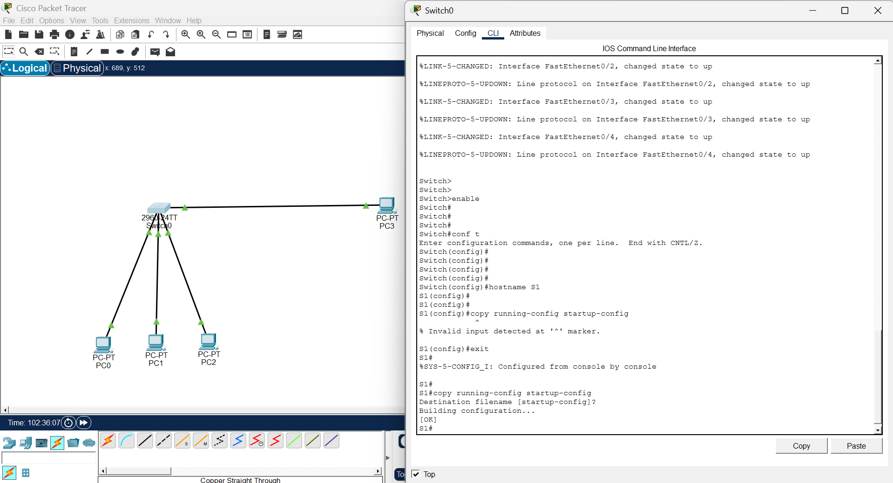

## What is a Hostname?

A hostname is the name given to a networking device (like a switch or router) to identify it on a network.

By default, Cisco switches are named “Switch”

Hostnames make devices easier to identify

Very useful in large networks with many devices

Appears in the CLI prompt

Example:

Before changing hostname:

text

Switch>

After changing hostname:

text

S1>

✅ This helps network administrators know which device they are configuring.

🧾 Syntax of Hostname Command
text

hostname <device-name>

Explanation:

hostname → Command keyword

<device-name> → The name you want to assign (e.g., S1, Lab-Switch, Office-SW)

## Rules:

Must start with a letter

No spaces allowed

Avoid special characters

Up to 63 characters

## Step-by-Step Configuration

✅ Step 1: Enter Privileged EXEC Mode
text

Switch> enable

✅ Step 2: Enter Global Configuration Mode
text

Switch# configure terminal

✅ Step 3: Change the Hostname
text

Switch(config)# hostname S1

After pressing Enter, the prompt changes immediately:

text

S1(config)#

✅ Step 4: Exit Configuration Mode
text

S1(config)# exit

✅ Step 5: Save the Configuration
text

S1# copy running-config startup-config

✅ This ensures the hostname remains after restarting the switch.

## 🌐 Topology Screenshot

