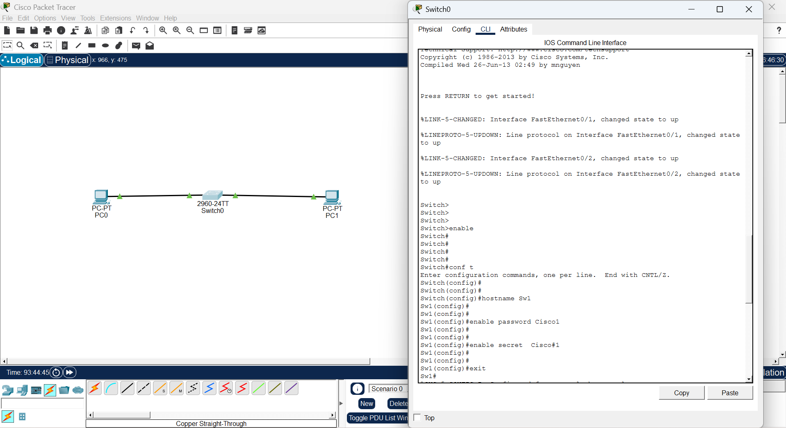

What is a Privileged EXEC Password?

A Privileged EXEC Password is a security password that protects access to the enable mode of a Cisco switch or router.

Without this password, anyone can access full switch configuration

It encrypts and protects your device from unauthorized access

enable secret is more secure than enable password

The password is encrypted automatically in the config file

Example:

Without password — anyone can type:

text

Switch> enable

Switch#

✅ With password set — user must enter password:

text

Switch> enable

Password: ********

S1#

🧾 Syntax of Enable Secret Command
text

enable secret <your-password>

Explanation:

enable secret → Command keyword (uses MD5 encryption)

<your-password> → The password you want to set (e.g., Cisco123)

⚠ Rules:

Case-sensitive

No spaces allowed

Use strong passwords (mix of letters, numbers, symbols)

enable secret always overrides enable password

## Step-by-Step Configuration

✅ Step 1: Enter Privileged EXEC Mode
text

Switch> enable

✅ Step 2: Enter Global Configuration Mode
text

Switch# configure terminal

✅ Step 3: Set the Privileged EXEC Password
text

Switch(config)# enable secret Cisco123

✅ Password is now set and encrypted automatically.

✅ Step 4: Exit Configuration Mode
text

S1(config)# exit

✅ Step 5: Save the Configuration
text

S1# copy running-config startup-config

✅ This ensures the password remains after restarting the switch.

## Verify the Password is Encrypted

You can verify by typing:

text

S1# show running-config

You will see something like:

text

enable secret 5 $1$mERr$hx5rVt7rPNoS4wqbXKX7m0

✅ The 5 means it is MD5 encrypted — not visible in plain text.

## 🌐 Topology Screenshot

