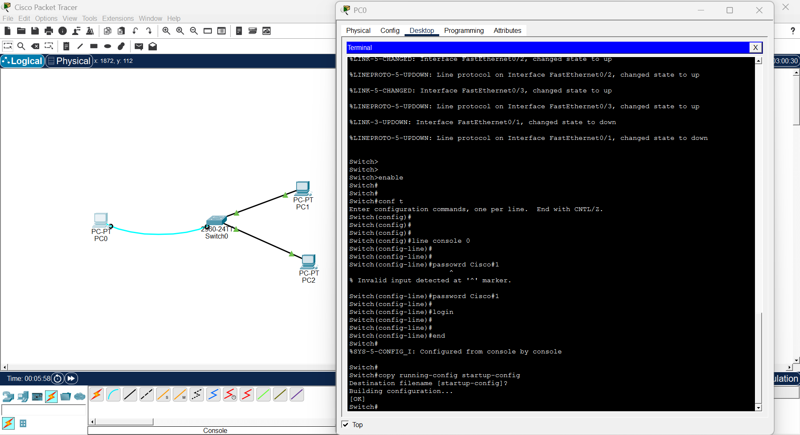

## What is a Console Port?

The Console Port is a physical port on a Cisco switch or router used for direct local management of the device.

It is the first way to access a new or unconfigured device

Uses a Console Cable (Rollover Cable) to connect

Connected from the switch console port to the PC COM port

Does not require network connectivity

Used when remote access is not available

Must be secured with a password to prevent unauthorized physical access

Example:

Without Console Password:

text

Switch>

✅ Anyone with physical access can configure the switch!

With Console Password:

text

User Access Verification

Password: ********

Switch>

✅ Physical access is now protected!

## Syntax of Console Port Configuration

text

line console 0

password <your-password>

login

exit

Explanation:

line console 0 → Enters console line configuration (only 1 console port exists = 0)

password → Sets the console access password

login → Enables password checking on login

exit → Returns to global config mode

## Rules:

There is only one console line = line console 0

Always add login after password or it will be ignored

Use a strong password

Case-sensitive

Save config after setting password

## Step-by-Step Configuration

✅ Step 1: Enter Privileged EXEC Mode
text

Switch> enable

✅ Step 2: Enter Global Configuration Mode
text

Switch# configure terminal

✅ Step 3: Enter Console Line Configuration
text

Switch(config)# line console 0

✅ There is only one console port so it is always 0

✅ Step 4: Set the Console Password
text

Switch(config-line)# password Cisco123

✅ Step 5: Enable Login Authentication
text

Switch(config-line)# login

✅ This activates the password requirement on console login.

✅ Step 6: Exit Line Configuration Mode
text

Switch(config-line)# exit

✅ Step 7: Save the Configuration
text

S1# copy running-config startup-config

✅ Password will remain saved after device restarts.

## 🌐 Topology Screenshot

## Verify Console Configuration

Type this to verify:

text

S1# show running-config

You will see:

text

line console 0
 
password Cisco123
 
login

✅ Confirms console line is secured with password.