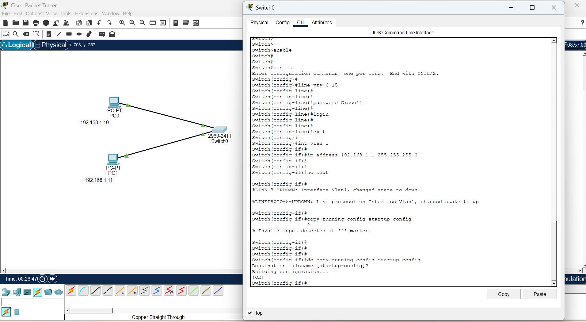

## phase 1:  What is Secure Remote Access (VTY)?

VTY (Virtual Terminal Lines) are virtual connections used to remotely access and manage a Cisco switch or router over a network.

VTY lines allow Telnet or SSH remote connections

Without VTY password, remote access is blocked

Cisco switches have 16 VTY lines (0–15)

Meaning 16 users can connect at the same time

Used by network administrators to manage devices remotely

Example:

Without VTY password:

text

Trying 192.168.1.1 ...

% Connection refused by remote host

✅ With VTY password set:

text

Trying 192.168.1.1 ...

User Access Verification

Password: ********

S1>

## Syntax of VTY Configuration

text

line vty <start-line> <end-line>

password <your-password>

login

Explanation:

line vty 0 15 → Opens all 16 virtual terminal lines

password → Sets the remote access password

login → Enables password checking on login

exit → Returns to global config mode

⚠ Rules:

Always use login after setting password

Without login command, password is ignored

Use SSH for more secure remote access

Use strong passwords (mix letters, numbers, symbols)

Case-sensitive password

##Step-by-Step Configuration

✅ Step 1: Enter Privileged EXEC Mode
text

Switch> enable

✅ Step 2: Enter Global Configuration Mode
text

Switch# configure terminal

✅ Step 3: Enter VTY Line Configuration
text

Switch(config)# line vty 0 15

✅ This opens all 16 VTY lines at once.

✅ Step 4: Set the Remote Access Password
text

Switch(config-line)# password Cisco#1

✅ Step 5: Enable Login Authentication
text

Switch(config-line)# login

✅ This activates the password requirement on remote login.

✅ Step 6: Exit Line Configuration Mode
text

Switch(config-line)# exit

✅ Step 7: Save the Configuration
text

S1# copy running-config startup-config

✅ Password will remain saved after device restarts.

## 🌐 Topology Screenshot

## Verify VTY Configuration

Type this to verify:

text

S1# show running-config

You will see:

text

line vty 0 4
 
password Cisco123
 
login

line vty 5 15
 
password Cisco123
 
login

✅ Confirms VTY lines are secured.

## phase 2:  is to assign ip address to vlan 1 

Switch Management IP Configuration (SVI):

For remote access to work, the switch must have an IP address:

text

S1# configure terminal

S1(config)# interface vlan 1

S1(config-if)# ip address 192.168.1.1 255.255.255.0

S1(config-if)# no shutdown

S1(config-if)# exit

S1# copy running-config startup-config

✅ Now the switch has an IP for remote access.

## phase 3:    How to Telnet from PC in Packet Tracer:

💻 How to Telnet from PC in Packet Tracer:
✅ Step 1: Go to PC1
text

Click PC1 → Desktop → Command Prompt

✅ Step 2: Type Telnet Command

text

PC> telnet 192.168.1.1

✅ Step 3: Enter Password

text

Trying 192.168.1.1 ...Open

User Access Verification

Password: Cisco#1

S1>

✅ You are now remotely managing the switch from PC1!