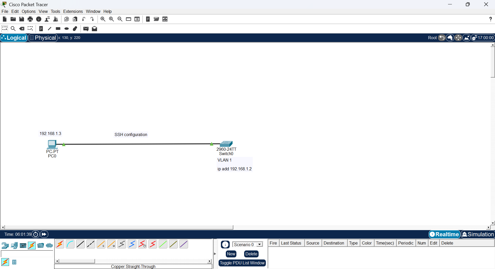

# Cisco Packet Tracer Project - Configure SSH on a Cisco Switch

## Description

SSH (Secure Shell) is a secure protocol that allows administrators to remotely access and manage Cisco switches over an encrypted connection.

In this project, you will configure SSH on a Cisco 2960 switch using Cisco Packet Tracer.

---

## Company Scenario

You have joined **TechSolutions Ltd.** as a Junior Network Administrator.

Your manager asks you to configure SSH on the company's switch so that administrators can securely manage the switch remotely.

---

# Task 1 – Configure the Management IP Address

The management IP address allows administrators to remotely access the switch.

### Commands

```text
Switch> enable

Switch# configure terminal

Switch(config)# interface vlan 1

Switch(config-if)# ip address 192.168.1.2 255.255.255.0

Switch(config-if)# no shutdown

Switch(config-if)# exit
```

### Command Explanation

- `enable` – Enter Privileged EXEC mode.
- `configure terminal` – Enter Global Configuration mode.
- `interface vlan 1` – Open the management interface.
- `ip address` – Assign the management IP address.
- `no shutdown` – Enable the interface.
- `exit` – Return to Global Configuration mode.

---

# Task 2 – Configure the Hostname and Domain Name

SSH requires a hostname and domain name before RSA keys can be generated.

### Commands

```text
Switch(config)# hostname SW1

SW1(config)# ip domain-name company.com
```

### Command Explanation

- `hostname SW1` – Change the switch name to **SW1**.
- `ip domain-name company.com` – Configure the domain name.

---

# Task 3 – Configure Local Security Credentials

Configure the administrator password and create a local user for SSH authentication.

### Commands

```text
SW1(config)# enable secret Cisco123

SW1(config)# username admin privilege 15 password Admin123
```

### Command Explanation

- `enable secret Cisco123` – Set the encrypted administrator password.
- `username admin privilege 15 password Admin123` – Create an administrator account for SSH.

---

# Task 4 – Generate RSA Keys and Enable SSH Version 2

Generate encryption keys and enable SSH.

### Commands

```text
SW1(config)# crypto key generate rsa
```

When prompted, enter:

```text
1024
```

Then type:

```text
SW1(config)# ip ssh version 2
```

### Command Explanation

- `crypto key generate rsa` – Generate RSA encryption keys.
- `1024` – Select the key size.
- `ip ssh version 2` – Enable SSH Version 2.

---

# Task 5 – Configure VTY Lines

Allow only SSH remote access.

### Commands

```text
SW1(config)# line vty 0 15

SW1(config-line)# login local

SW1(config-line)# transport input ssh

SW1(config-line)# exit

SW1(config)# exit

SW1# write memory
```

### Command Explanation

- `line vty 0 15` – Configure all remote login lines.
- `login local` – Use the local username and password.
- `transport input ssh` – Allow only SSH connections.
- `write memory` – Save the configuration.

---

# Task 6 – Test the SSH Connection

Open **PC0**.

Go to:

**Desktop → Command Prompt**

Type:

```text
ssh -l admin 192.168.1.2
```

Enter the password:

```text
Admin123
```

If the login is successful, SSH has been configured correctly.

---

# Verify the Configuration

Run the following commands on the switch:

```text
show ip ssh

show ssh

show running-config
```

These commands verify that SSH is enabled and correctly configured.

---

## 🌐 Topology Screenshot



# What I Learned

- Configure a management IP address.
- Configure the hostname and domain name.
- Create local users for SSH authentication.
- Generate RSA encryption keys.
- Enable SSH Version 2.
- Configure VTY lines for secure remote access.
- Test SSH from a PC.
- Verify the SSH configuration using Cisco IOS commands.