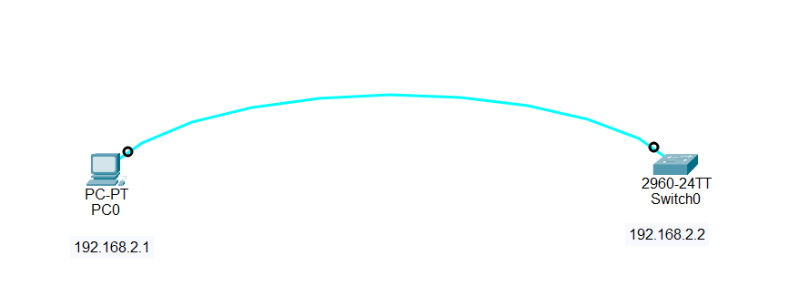

## What is a Banner in Cisco Devices?

A Banner is a message displayed to users when they connect to a Cisco router or switch.

It is used to:

-Warn unauthorized users
-Show security messages
-Provide system information
-Display legal notices

⚠️ Important:
A banner does NOT secure the device by itself. It only displays a message.

## Types of Cisco Banners

1. MOTD Banner (Message of the Day)

Displays before login

Shows general warning or message to all users

Example:

UNAUTHORIZED ACCESS IS STRICTLY PROHIBITED

2. Login Banner

Displays before username/password prompt

Used for stronger warning messages

Example:

Authorized users only. Login required.

## Syntax of Banner MOTD Command

banner motd <delimiter> message <delimiter>

Explanation:

banner motd → Command to create a message of the day

<delimiter> → A special character used to start and end the message (e.g. #, $, %)

message → The warning or information text

## Rules

The same delimiter must be used at start and end

Any character can be used (#, $, %, !)

Message appears to every user who connects

Message is displayed BEFORE login

## Step-by-Step Configuration

✅ Step 1: Enter Privileged EXEC Mode

Switch> enable

✅ Step 2: Enter Global Configuration Mode

Switch# configure terminal

✅ Step 3: Configure MOTD Banner

Switch(config)# banner motd #
*************************************************
WARNING: UNAUTHORIZED ACCESS IS STRICTLY PROHIBITED
*************************************************

✅ Step 4: Configure Login Banner (Optional)

Switch(config)# banner login %
*************************************************
AUTHORIZED USERS ONLY - LOGIN REQUIRED
*************************************************
%

✅ Step 5: Exit Configuration Mode

✅ Step 6: Save Configuration

Switch# copy running-config startup-config

✔ This ensures the banner stays after reboot.

## Verify Banner Configuration

You can verify using:

Switch# show running-config

You will see:

banner motd #
WARNING: UNAUTHORIZED ACCESS IS STRICTLY PROHIBITED
#

🌐 Topology Screenshot

