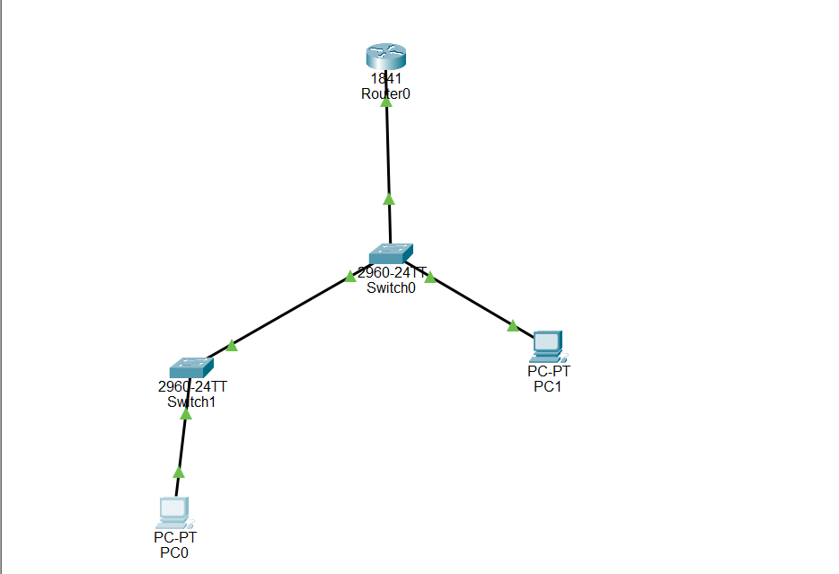

## What is NTP in Cisco Devices?

NTP (Network Time Protocol) is used to synchronize time across multiple network devices using a central time source.

It ensures all devices in a network have the same correct time for logs, security, and troubleshooting.

It is used to:

- Synchronize time across routers and switches

- Improve log accuracy for troubleshooting

- Support security auditing and monitoring

- Ensure consistent timestamps across the network

⚠️ Important:

NTP does NOT set time manually — it automatically syncs time from a time server.

## Why NTP is Important

- Network logs depend on correct timestamps

- Security incidents must be tracked accurately

-Multiple devices must show the same time

-Helps engineers troubleshoot network issues

- Required in enterprise networks and CCNA labs

## NTP Roles in This Topology

1. NTP Master Server (Router R1)

- Acts as the main time source

- Provides time to all other devices

2. Distribution Switch (SW1)

- Receives time from router

- Can also forward time to other switches

3. Access Switch (SW2)

- Gets time from SW1 or R1 (depending on design)

4. PC Clients

- Used for testing connectivity only

## Step-by-Step Configuration

✅ Step 1: Configure NTP Server (Router)

Router> enable

Router# configure terminal

Router(config)# ntp master 1

✔ This makes the router act as a time server.

🟢 Step 2: Configure SW1 (Distribution Switch)

SW1> enable

SW1# configure terminal

SW1(config)# interface vlan 1

SW1(config-if)# ip address 192.168.1.2 255.255.255.0

SW1(config-if)# no shutdown

exit

SW1(config)# ip default-gateway 192.168.1.1

SW1(config)# ntp server 192.168.1.1

🟢 Step 3: Configure SW2 (Access Switch)

SW2> enable

SW2# configure terminal

SW2(config)# interface vlan 1

SW2(config-if)# ip address 192.168.1.3 255.255.255.0

SW2(config-if)# no shutdown

exit

SW2(config)# ip default-gateway 192.168.1.1

SW2(config)# ntp server 192.168.1.2

🟢 Step 4: Configure PCs

PC1:

IP: 192.168.1.10

Subnet: 255.255.255.0

Gateway: 192.168.1.1

PC2:

IP: 192.168.1.11

Subnet: 255.255.255.0

Gateway: 192.168.1.1

🌐 Topology Screenshot

##  Verification Commands

On Router:

show ntp status

On Switches:

show clock

show ntp associations

show running-config

## Save Configuration

copy running-config startup-config
