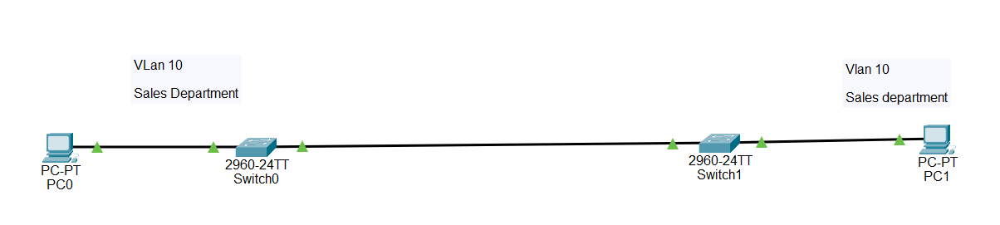

## What is a VLAN in Cisco Devices?

A VLAN (Virtual Local Area Network) is used to divide one physical switch into multiple logical networks.

It allows devices in the same VLAN to communicate with each other while separating them from devices in other VLANs.

## It is used to:

- Separate departments (Sales, HR, IT, Finance)

- Improve network security

- Reduce unnecessary network traffic

- Make network management easier

⚠️ Important:

A VLAN only works inside a switch. If different VLANs need to communicate, you must use a router or a Layer 3 switch for Inter-VLAN Routing.

- Why VLAN is Important

- Separates different departments

- Improves security

- Reduces broadcast traffic

- Makes troubleshooting easier

- Required in enterprise networks and CCNA labs

## Step-by-Step Configuration

✅ Step 1: Create and Name the VLAN (Switch 1)

Switch> enable

Switch# configure terminal

Switch(config)# vlan 10

Switch(config-vlan)# name Sales_Department

Switch(config-vlan)# exit

✔ This creates VLAN 10 named Sales_Department

✅ Step 2: Assign Ports to VLAN 10 (Switch 1)

Switch(config)# interface FastEthernet0/1

Switch(config-if)# switchport mode access

Switch(config-if)# switchport access vlan 10

Switch(config-if)# exit

✔ PC1 is now in VLAN 10.

✅ Step 3: Configure the Trunk Port (Switch 1)

Switch(config)# interface GigabitEthernet0/1

Switch(config-if)# switchport mode trunk

Switch(config-if)# end

✔ This allows VLAN traffic to pass between the two switches.

✅ Step 4: Configure VLAN 10 on Switch 2

Switch> enable

Switch# configure terminal

Switch(config)# vlan 10

Switch(config-vlan)# name Sales_Department

Switch(config-vlan)# exit

✅ Step 5: Assign PC2 to VLAN 10

Switch(config)# interface FastEthernet0/1

Switch(config-if)# switchport mode access

Switch(config-if)# switchport access vlan 10

Switch(config-if)# exit

✅ Step 6: Configure the Trunk Port on Switch 2

Switch(config)# interface GigabitEthernet0/1

Switch(config-if)# switchport mode trunk

Switch(config-if)# end

✅ Step 7: Configure PCs

PC1
IP Address : 192.168.10.10

Subnet Mask : 255.255.255.0
PC2

IP Address : 192.168.10.11

Subnet Mask : 255.255.255.0

🌐 Topology Screenshot

## Verification Commands

1.On either switch:

show vlan brief

2.Displays all VLANs and assigned ports.

show interfaces trunk

3.Displays trunk ports and allowed VLANs.

show running-config

4.Displays the current configuration.

show mac address-table

Shows learned MAC addresses for each VLAN.