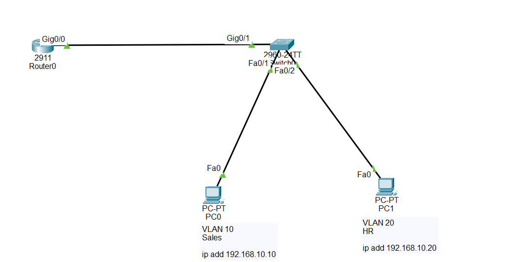

Router-on-a-Stick Configuration in Cisco Devices

What is Router-on-a-Stick?

Router-on-a-Stick (ROAS) is a method that allows a single physical router interface to route traffic between multiple VLANs.

Instead of using one router interface for each VLAN, Router-on-a-Stick uses one physical interface divided into multiple sub-interfaces. Each sub-interface is assigned to a specific VLAN 

using IEEE 802.1Q encapsulation.

It is used to:

Allow communication between different VLANs

Reduce the number of router interfaces required

Provide Inter-VLAN Routing using one physical connection

Save hardware costs in small and medium-sized networks

Important:

Router-on-a-Stick requires:

A trunk link between the switch and the router

One sub-interface for each VLAN

802.1Q encapsulation on each sub-interface

An IP address on each sub-interface to act as the default gateway for its VLAN

- Why Router-on-a-Stick is Important

- Allows communication between different VLANs

- Uses only one physical router interface

- Reduces hardware costs

- Easy to configure for small networks

- Commonly used in CCNA labs

## Step-by-Step Configuration

✅ Step 1: Create and Name the VLANs (Switch)

Switch> enable

Switch# configure terminal

Switch(config)# vlan 10

Switch(config-vlan)# name Sales

Switch(config-vlan)# exit

Switch(config)# vlan 20

Switch(config-vlan)# name HR

Switch(config-vlan)# exit

✔ This creates VLAN 10 (Sales) and VLAN 20 (HR).

Step 2: Assign Access Ports to VLANs

## Configure PC1 Port (VLAN 10)

Switch(config)# interface FastEthernet0/1

Switch(config-if)# switchport mode access

Switch(config-if)# switchport access vlan 10

Switch(config-if)# exit

✔ PC1 is now a member of VLAN 10.

## Configure PC2 Port (VLAN 20)

Switch(config)# interface FastEthernet0/2

Switch(config-if)# switchport mode access

Switch(config-if)# switchport access vlan 20

Switch(config-if)# exit

✔ PC2 is now a member of VLAN 20.

✅ Step 3: Configure the Trunk Port on the Switch

Switch(config)# interface GigabitEthernet0/1

Switch(config-if)# switchport mode trunk

Switch(config-if)# switchport trunk allowed vlan 10,20

Switch(config-if)# end

✔ The trunk link now carries traffic for VLAN 10 and VLAN 20.

✅ Step 4: Enable the Router Interface

Router> enable

Router# configure terminal

Router(config)# interface GigabitEthernet0/0

Router(config-if)# no shutdown

Router(config-if)# exit

✔ The physical router interface is enabled.

✅ Step 5: Configure the Sub-interface for VLAN 10

Router(config)# interface GigabitEthernet0/0.10

Router(config-subif)# encapsulation dot1Q 10

Router(config-subif)# ip address 192.168.10.1 255.255.255.0

Router(config-subif)# exit

✔ This sub-interface routes traffic for VLAN 10 and serves as its default gateway.

✅ Step 6: Configure the Sub-interface for VLAN 20

Router(config)# interface GigabitEthernet0/0.20

Router(config-subif)# encapsulation dot1Q 20

Router(config-subif)# ip address 192.168.20.1 255.255.255.0

Router(config-subif)# end

✔ This sub-interface routes traffic for VLAN 20 and serves as its default gateway.

## 🌐 Topology Screenshot

✅ Step 7: Configure the PCs

PC1

IP Address : 192.168.10.10

Subnet Mask : 255.255.255.0

Default Gateway : 192.168.10.1

PC2

IP Address : 192.168.20.10

Subnet Mask : 255.255.255.0

Default Gateway : 192.168.20.1

## Verification Commands

On the Switch

Display the trunk interface:

                show interfaces trunk

Displays the trunk port and the VLANs allowed across the trunk.

Display all VLANs:

              show vlan brief

Displays the VLANs and their assigned access ports.

Display the current configuration:

            show running-config

Displays the switch configuration.

On the Router

Display the routing table:

show ip route

Shows the directly connected networks for VLAN 10 and VLAN 20.

Display the configured sub-interfaces:

show ip interface brief

Shows the status and IP addresses of all interfaces and sub-interfaces.