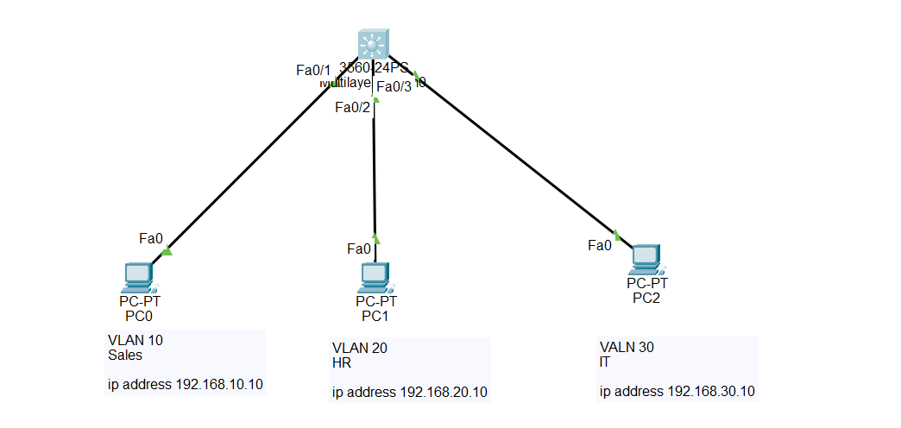

## What is a Switch Virtual Interface (SVI)?

A Switch Virtual Interface (SVI) is a virtual Layer 3 interface associated with a VLAN on a Cisco switch.

Unlike physical interfaces, an SVI is a logical interface that allows the switch to communicate using an IP address.

An SVI is used for:

Remote management of a switch (SSH, Telnet, Ping)

- Inter-VLAN Routing on Layer 3 switches

- Providing a default gateway for devices in a VLAN

- Monitoring and managing the switch over the network

Important:

- On a Layer 2 switch, an SVI is mainly used for management.

- On a Layer 3 switch, an SVI can also route traffic between VLANs when IP routing is enabled.

- An SVI will remain down unless:

- The VLAN exists.

- At least one switch port in that VLAN is active (up).

- The SVI is enabled using no shutdown.

## Why SVI is Important

- Provides remote switch management

- Acts as the default gateway on Layer 3 switches

- Enables Inter-VLAN Routing

- Eliminates the need for a separate router in many networks

- Widely used in enterprise networks and CCNA labs

Step-by-Step Configuration

✅ Step 1: Enter Global Configuration Mode

Switch> enable

Switch# configure terminal

✅ Step 2: Enable IP Routing

Switch(config)# ip routing

✔ Enables the Layer 3 switch to route traffic between VLANs.

✅ Step 3: Create the VLANs

Switch(config)# vlan 10

Switch(config-vlan)# name Sales

Switch(config-vlan)# exit

Switch(config)# vlan 20

Switch(config-vlan)# name HR

Switch(config-vlan)# exit

Switch(config)# vlan 30

Switch(config-vlan)# name IT

Switch(config-vlan)# exit

✔ Creates VLANs 10, 20, and 30.

✅ Step 4: Assign Access Ports

VLAN 10

Switch(config)# interface FastEthernet0/1

Switch(config-if)# switchport mode access

Switch(config-if)# switchport access vlan 10

Switch(config-if)# exit

VLAN 20

Switch(config)# interface FastEthernet0/2

Switch(config-if)# switchport mode access

Switch(config-if)# switchport access vlan 20

Switch(config-if)# exit

VLAN 30

Switch(config)# interface FastEthernet0/3

Switch(config-if)# switchport mode access

Switch(config-if)# switchport access vlan 30

Switch(config-if)# exit

✔ Each PC is assigned to its respective VLAN.

✅ Step 5: Configure the SVI for VLAN 10

Switch(config)# interface vlan 10

Switch(config-if)# ip address 192.168.10.1 255.255.255.0

Switch(config-if)# no shutdown

Switch(config-if)# exit

✔ Creates the default gateway for VLAN 10.

✅ Step 6: Configure the SVI for VLAN 20

Switch(config)# interface vlan 20

Switch(config-if)# ip address 192.168.20.1 255.255.255.0

Switch(config-if)# no shutdown

Switch(config-if)# exit

✔ Creates the default gateway for VLAN 20.

✅ Step 7: Configure the SVI for VLAN 30

Switch(config)# interface vlan 30

Switch(config-if)# ip address 192.168.30.1 255.255.255.0

Switch(config-if)# no shutdown

Switch(config-if)# exit

✔ Creates the default gateway for VLAN 30.

✅ Step 8: Configure the PCs

PC1

IP Address : 192.168.10.10

Subnet Mask : 255.255.255.0

Default Gateway : 192.168.10.1

PC2

IP Address : 192.168.20.10

Subnet Mask : 255.255.255.0

Default Gateway : 192.168.20.1

PC3

IP Address : 192.168.30.10

Subnet Mask : 255.255.255.0

Default Gateway : 192.168.30.1

## 🌐 Topology Screenshot

## Verification Commands

Display VLANs

      show vlan brief

Displays all VLANs and their assigned ports.

Display SVI Status

    show ip interface brief

Displays all physical interfaces and SVIs with their IP addresses and status.

Display Routing Table

    show ip route

Shows the directly connected VLAN networks.

Display Running Configuration

     show running-config

Displays the current switch configuration.