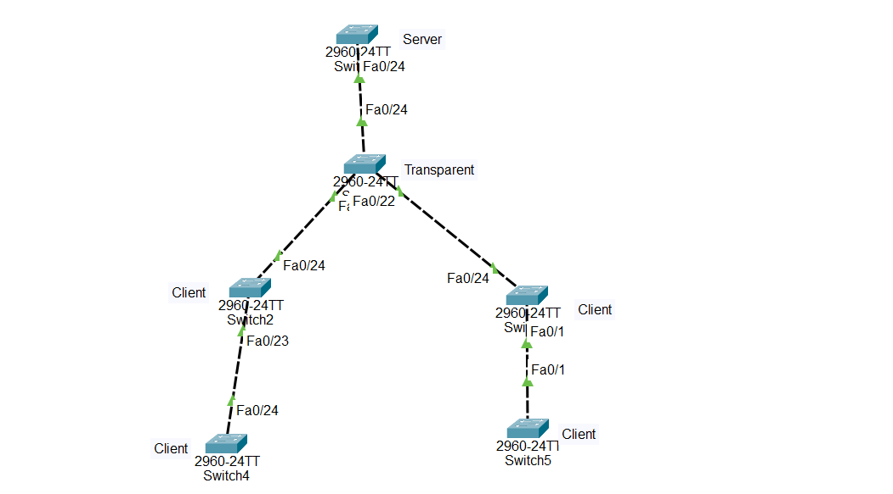

## VTP (VLAN Trunking Protocol) Configuration in Cisco Devices

What is VTP?

VTP (VLAN Trunking Protocol) is a Cisco proprietary protocol that distributes VLAN information between switches in the same VTP domain.

Instead of creating VLANs manually on every switch, you create them once on a VTP Server, and the information is automatically synchronized to all VTP Clients through trunk links.

## VTP is used to:

Automatically distribute VLAN information

Reduce VLAN configuration time

Maintain VLAN consistency

Simplify network administration

Important:

VTP advertisements travel only over trunk links.

All switches must have the same:

VTP Domain Name

VTP Version

Password (if configured)

A higher Configuration Revision Number overwrites a lower one.

## Why VTP is Important

Creates VLANs once instead of on every switch

Automatically synchronizes VLANs

Reduces configuration errors

Simplifies administration

Common in CCNA labs

VTP Modes

## VTP Server

Can create VLANs

Can modify VLANs

Can delete VLANs

Synchronizes VLAN information

Sends VTP advertisements

## VTP Client

Cannot create VLANs

Cannot delete VLANs

Receives VLAN information automatically

Forwards advertisements

## VTP Transparent

Does not synchronize its VLAN database

Can create local VLANs only

Forwards VTP advertisements to other switches

## Step-by-Step Configuration

Step 1 — Configure the VTP Server

Switch> enable

Switch# configure terminal

Switch(config)# vtp mode server

Switch(config)# vtp domain COMPANY

Switch(config)# vtp password Cisco123

Switch(config)# vtp version 2

Step 2 — Configure the VTP Transparent Switch
Switch> enable

Switch# configure terminal

Switch(config)# vtp mode transparent

Switch(config)# vtp domain COMPANY

Switch(config)# vtp password Cisco123

Switch(config)# vtp version 2

Step 3 — Configure Each VTP Client

Repeat on Switch3, Switch4, Switch5, and Switch6.

Switch> enable

Switch# configure terminal

Switch(config)# vtp mode client

Switch(config)# vtp domain COMPANY

Switch(config)# vtp password Cisco123

Switch(config)# vtp version 2

Step 4 — Configure Trunk Links

Configure every switch-to-switch connection as a trunk.

Switch(config)# interface GigabitEthernet0/1

Switch(config-if)# switchport mode trunk

Switch(config-if)# end

Step 5 — Create VLANs on the VTP Server

Only on Switch1:

Switch(config)# vlan 10

Switch(config-vlan)# name Sales

Switch(config-vlan)# exit

Switch(config)# vlan 20

Switch(config-vlan)# name HR

Switch(config-vlan)# exit

Switch(config)# vlan 30

Switch(config-vlan)# name IT

Switch(config-vlan)# exit

## 🌐 Topology Screenshot

## Verification Commands

Check VTP status:

    show vtp status

Check VLANs:

    show vlan brief

Check trunk ports:

    show interfaces trunk

Check running configuration:

    show running-config
