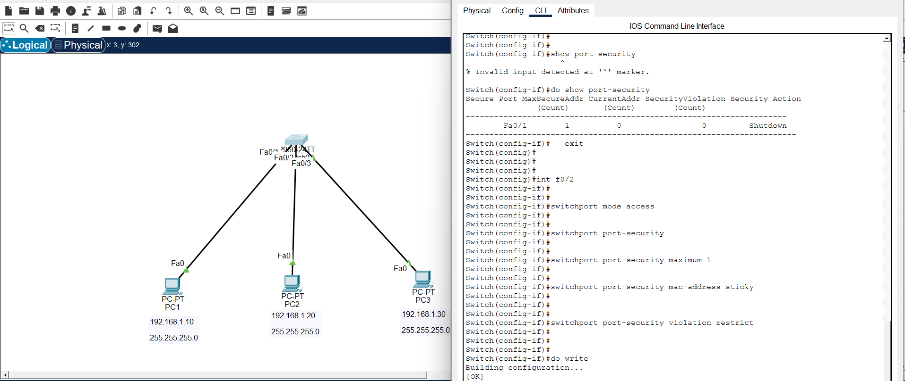

# 🔐 Port Security Configuration in Cisco Switches

## What is Port Security?

Port Security is a Cisco switch security feature that allows administrators to control which devices can connect to specific switch ports by using their MAC addresses.

It prevents unauthorized devices from accessing the network by limiting the number of MAC addresses allowed on a switch port.

Instead of allowing any device to connect, the administrator can specify which devices are trusted and define what action the switch should take when an unknown device connects.

---

# Port Security is used to:

- Prevent unauthorized devices from connecting to the network

- Control the number of MAC addresses allowed on a switch port

- Protect against MAC address flooding attacks

- Increase LAN security

- Control access to network resources

---

# Important Notes:

Port Security can only be configured on:

- Access ports

- Ports connected to end devices (PCs, printers, IP phones)

Port Security **cannot be configured on:**

- Trunk ports

- Dynamic ports

Example:

A switch port connected to another switch must be a trunk port, therefore port security cannot be applied.

---

# Why Port Security is Important

- Prevents unknown devices from joining the network

- Protects against MAC flooding attacks

- Provides access control at Layer 2

- Improves network security

- Common security feature tested in CCNA labs

---

# Port Security MAC Address Learning Methods

## 1. Static MAC Address

The administrator manually enters the MAC address allowed on the port.

Example:

```
switchport port-security mac-address 00AA.BBCC.DDEE
```

Advantages:

- Very secure

- Administrator has full control


Disadvantages:

- Requires manual configuration

---

## 2. Sticky MAC Address

The switch automatically learns the first connected device MAC address and saves it into the configuration.

Example:

```
switchport port-security mac-address sticky
```

Advantages:

- Easy to configure

- Commonly used in real networks

---

## 3. Dynamic MAC Address

The switch automatically learns MAC addresses temporarily.

The MAC address is removed after reboot.

(Default behavior)

---

# Port Security Violation Modes

## Shutdown Mode

(Default and recommended)

When an unauthorized device connects:

- The port goes into error-disabled state

- Traffic is blocked

Example:

```
switchport port-security violation shutdown
```

---

## Restrict Mode

When an unauthorized device connects:

- Traffic is dropped

- The switch generates security messages

Example:

```
switchport port-security violation restrict
```

---

## Protect Mode

When an unauthorized device connects:

- Traffic is silently dropped

- No notification is generated

Example:

```
switchport port-security violation protect
```

---

# Step-by-Step Configuration

## Step 1 — Enter Global Configuration Mode

```
Switch> enable

Switch# configure terminal
```

---

# Step 2 — Select the Interface

Example: Configure FastEthernet 0/1

```
Switch(config)# interface fastEthernet 0/1
```

---

# Step 3 — Change Port Mode to Access

Port security cannot work on trunk or dynamic ports.

```
Switch(config-if)# switchport mode access
```

---

# Step 4 — Enable Port Security

```
Switch(config-if)# switchport port-security
```

---

# Step 5 — Configure Maximum MAC Addresses

Example: Allow only one device:

```
Switch(config-if)# switchport port-security maximum 1
```

Example: Allow PC + IP Phone:

```
Switch(config-if)# switchport port-security maximum 2
```

---

# Step 6 — Enable Sticky MAC Learning

```
Switch(config-if)# switchport port-security mac-address sticky
```

The switch will automatically learn the connected device MAC address.

---

# Step 7 — Configure Violation Action

Example: Shutdown the port if an unknown device connects.

```
Switch(config-if)# switchport port-security violation shutdown
```

---

# Step 8 — Save Configuration

```
Switch(config-if)# end

Switch# copy running-config startup-config
```
## 🌐 Topology Screenshot



# 🎯 Packet Tracer Tasks

## Task 1 — Configure Port Security on Fa0/1

Requirements:

- Enable port security

- Allow only one MAC address

- Use sticky MAC learning

- Use shutdown violation mode


Commands:

```
interface fastEthernet 0/1

switchport mode access

switchport port-security

switchport port-security maximum 1

switchport port-security mac-address sticky

switchport port-security violation shutdown
```

---

## Task 2 — Configure Port Security on Fa0/2

Requirements:

- Allow one MAC address

- Use sticky learning

- Use restrict violation mode


Commands:

```
interface fastEthernet 0/2

switchport mode access

switchport port-security

switchport port-security maximum 1

switchport port-security mac-address sticky

switchport port-security violation restrict
```

---

## Task 3 — Test Unauthorized Access

1. Disconnect PC1 from Fa0/1

2. Connect PC3 to Fa0/1

3. Try sending a ping

Expected result:

- The port should become disabled because of security violation.

---

# Verification Commands

## Check Port Security Status

```
show port-security
```

---

## Check Specific Interface Security

Example:

```
show port-security interface fastEthernet 0/1
```

---

## Check Learned MAC Addresses

```
show mac address-table
```

---

## Check Interface Status

```
show interfaces status
```

---

## Check Running Configuration

```
show running-config
```

---

# Expected Result

After configuration:

✅ Only trusted devices can access the switch ports

✅ Unknown devices are blocked

✅ MAC addresses are automatically learned

✅ Unauthorized connections trigger security actions

---

# Conclusion

Port Security is an important Layer 2 security feature in Cisco networks. It helps administrators control access to switch ports, prevent unauthorized connections, and improve LAN security.