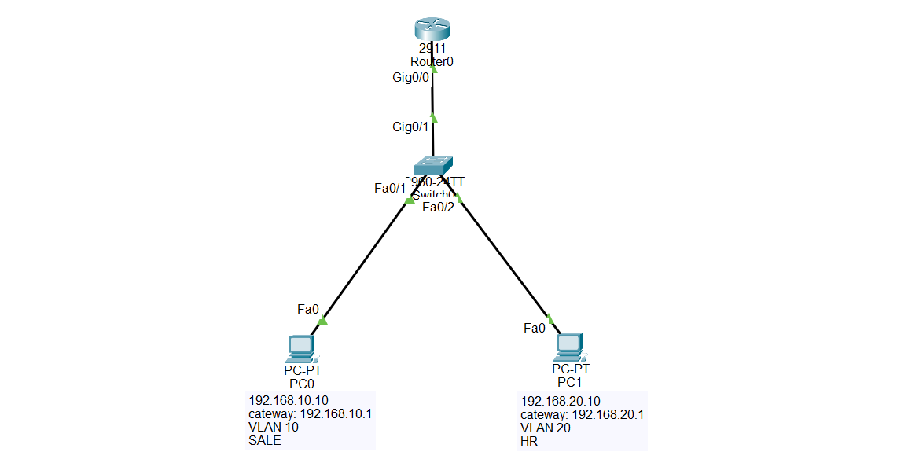

README 01 – Standard ACL: Block One Host

## What is a Standard ACL?

A Standard Access Control List (Standard ACL) is a Cisco security feature that filters network traffic based only on the source IP address.

It allows or denies packets depending on where they come from, without checking the destination IP address, protocol, or port numbers.

Standard ACLs use numbers 1–99 (or 1300–1999) or can be configured with a name.

## Standard ACL is used to:

- Control access based on the source IP address.

- Allow or deny specific hosts or networks.

- Improve network security.

- Restrict access to network resources.

- Filter traffic entering or leaving an interface.

## Important Notes

- Standard ACLs examine only the source IP address.

- Every ACL has an implicit deny any at the end.

- Add permit any if you want to allow all other traffic.

- Standard ACLs should be placed as close to the destination as possible.

## Why Standard ACL is Important

- Prevents unauthorized hosts from accessing a network.

- Provides basic Layer 3 security.

- Controls traffic between VLANs.

- Frequently used in CCNA labs and exams.

🎯 Packet Tracer Task

# Create two VLANs:

- VLAN 10 → Sales

- VLAN 20 → HR

# Requirements:

- PC1 is in VLAN 10.

- PC2 is in VLAN 20.

- Configure Router-on-a-Stick.

- Block PC1 (192.168.10.10) from accessing VLAN 20.

- Allow all other devices.

## Configuration Steps

Step 1 – Create VLANs

enable

configure terminal

vlan 10

name SALES

vlan 20

name HR

Step 2 – Assign Access Ports

interface fa0/1

switchport mode access

switchport access vlan 10

interface fa0/2

switchport mode access

switchport aStep 3 – Configure Trunk

interface g0/1

switchport mode trunkccess vlan 20

Step 4 – Configure Router-on-a-Stick

interface g0/0

no shutdown

interface g0/0.10

encapsulation dot1Q 10

ip address 192.168.10.1 255.255.255.0

interface g0/0.20

encapsulation dot1Q 20

ip address 192.168.20.1 255.255.255.0

Step 5 – Configure the Standard ACL

access-list 10 deny host 192.168.10.10

access-list 10 permit any

Step 6 – Apply the ACL

interface g0/0.20

ip access-group 10 out

## 🌐 Topology Screenshot

## Verification

show access-lists

show ip interface

show running-config