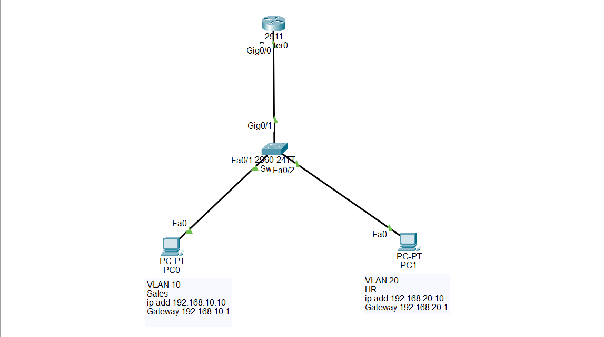

## What is an Extended ACL?

An Extended Access Control List (Extended ACL) is a Cisco security feature that filters network traffic based on multiple criteria instead of only the source IP address.

# Unlike a Standard ACL, an Extended ACL can examine:

Source IP address
Destination IP address
Protocol (TCP, UDP, ICMP, IP)
Port numbers

This provides much greater control over network traffic.

Extended ACLs use numbers 100–199 and 2000–2699, or they can be configured using a descriptive name.

## Extended ACL is used to:

- Filter traffic based on source and destination IP addresses.
- Allow or deny specific protocols.
- Control access to applications using TCP or UDP ports.
- Improve network security.
- Prevent unauthorized access to servers.
- Control communication between VLANs.

## Important Notes

Extended ACLs examine the source IP, destination IP, protocol, and optional port numbers.
Every Extended ACL ends with an implicit deny ip any any.
Add permit ip any any if you want to allow all remaining traffic.
Extended ACLs should be placed as close to the source as possible to stop unwanted traffic before it crosses the network.

## Why Extended ACL is Important

- Provides more precise traffic filtering than Standard ACLs.
- Protects servers and sensitive resources.
- Allows only authorized services.
- Reduces unnecessary network traffic.
- Commonly used in enterprise networks.
- Frequently tested in the CCNA certification.

🎯 Packet Tracer Task

1. Create two VLANs:

VLAN 10 → Sales

VLAN 20 → HR

Requirements

PC1 is in VLAN 10.

PC2 is in VLAN 20.

Configure Router-on-a-Stick.

Block HTTP (Port 80) traffic from PC1 (192.168.10.10) to PC2 
(192.168.20.10).

Allow all other traffic between the VLANs.

## Configuration Steps

Step 1 – Create VLANs
enable

configure terminal

vlan 10
name SALES

vlan 20
name HR

Step 2 – Assign Access Ports

interface fa0/1
switchport mode access
switchport access vlan 10

interface fa0/2
switchport mode access
switchport access vlan 20

Step 3 – Configure the Trunk Port

interface g0/1
switchport mode trunk

Step 4 – Configure Router-on-a-Stick

interface g0/0
no shutdown

interface g0/0.10
encapsulation dot1Q 10
ip address 192.168.10.1 255.255.255.0

interface g0/0.20
encapsulation dot1Q 20
ip address 192.168.20.1 255.255.255.0

Step 5 – Configure the Extended ACL

access-list 100 deny icmp host 192.168.10.10 host 192.168.20.10 

access-list 100 permit ip any any

Step 6 – Apply the ACL

Because Extended ACLs should be placed close to the source, apply it inbound on VLAN 10.

interface g0/0.10

ip access-group 100 in

## 🌐 Topology Screenshot

## Verification

Display the configured ACL.

       show access-lists

Verify that the ACL is applied to the correct interface.

       show ip interface

Display the running configuration.

        show running-config

Ty to ping from PC1 to PC2 and the It cannot ping because you have block the connectivity of that protocol icmp

