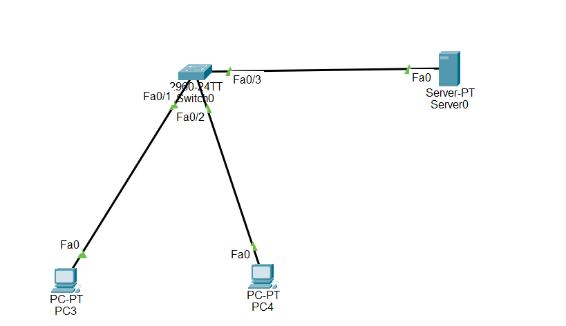

## What is DHCP Snooping

DHCP Snooping is a Layer 2 security feature on Cisco switches that protects the network against unauthorized (rogue) DHCP servers.

It monitors DHCP messages exchanged between clients and DHCP servers and allows only trusted DHCP servers to assign IP addresses to clients.

Any DHCP Offer or DHCP ACK message received from an untrusted interface is automatically dropped by the switch.

## DHCP Snooping is used to:

- Prevent rogue DHCP servers.
- Protect clients from receiving fake IP addresses.
- Prevent Man-in-the-Middle (MITM) attacks.
- Prevent DHCP starvation attacks.
- Improve Layer 2 network security.

## Important Notes

- DHCP Snooping is disabled by default.
- DHCP Snooping works only on Layer 2 switches.
- All switch ports are untrusted by default.
- Only the port connected to the legitimate DHCP server should be configured as trusted.
- DHCP Snooping must be enabled globally and for each VLAN.

## Why DHCP Snooping is Important

- Prevents attackers from acting as fake DHCP servers.
- Ensures clients receive network information only from authorized DHCP servers.
- Protects the default gateway and DNS information from being modified.
- Protects enterprise networks from common Layer 2 attacks.

🎯 Packet Tracer Task

Create one VLAN
VLAN 10 → Users

## Requirements
- Configure one Cisco switch.
- Configure one legitimate DHCP Server.
- Configure two PCs.
- Enable DHCP Snooping.
- Trust only the interface connected to the DHCP Server.
- Leave all client interfaces untrusted.
- Verify that clients receive IP addresses only from the legitimate DHCP Server.

## Configuration Steps

Step 1 – Create VLAN
enable

configure terminal

vlan 10

name USERS

Step 2 – Assign Access Ports

interface fa0/1

switchport mode access

switchport access vlan 10

interface fa0/2

switchport mode access

switchport access vlan 10

interface fa0/3

switchport mode access

switchport access vlan 10

Step 3 – Enable DHCP Snooping

ip dhcp snooping

Step 4 – Enable DHCP Snooping on VLAN 10

ip dhcp snooping vlan 10

Step 5 – Configure the Trusted Port

Assume the DHCP Server is connected to FastEthernet0/1.

interface fa0/1

ip dhcp snooping trust

Step 6 – Leave Client Ports Untrusted

No configuration is required.

All interfaces are untrusted by default.

Step 7 – Configure Rate Limiting

Limit DHCP Discover messages from client ports.

interface range fa0/2 - 3

ip dhcp snooping limit rate 10

This allows a maximum of 10 DHCP packets per second.

## 🌐 Topology Screenshot

Verification

Display DHCP Snooping information.

       show ip dhcp snooping

Display trusted interfaces.

       show ip dhcp snooping binding

Display running configuration.

       show running-config
