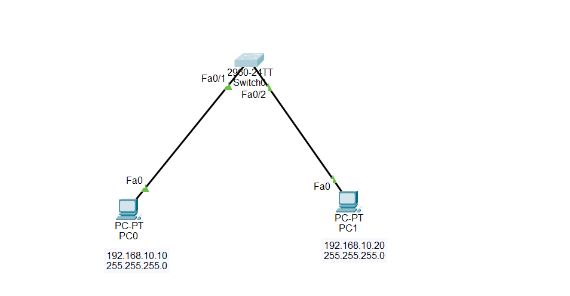

# Cisco Packet Tracer Lab - Storm Control

## Objective

Learn how to configure **Storm Control** on a Cisco switch to protect the network from excessive Layer 2 traffic such as broadcast, multicast, and unknown unicast traffic.

---

## What is Storm Control?

Storm Control is a Cisco switch security feature that limits excessive Layer 2 traffic on an interface.

It protects the network from:

- Broadcast storms
- Multicast storms
- Unknown unicast floods

Without Storm Control, excessive traffic can consume switch resources and reduce network performance.

---

## Why Use Storm Control?

Storm Control helps to:

- Prevent network congestion
- Protect switch CPU and bandwidth
- Improve network stability
- Reduce unnecessary Layer 2 traffic
- Prevent broadcast storms

---

## Types of Traffic Controlled

### Broadcast

Traffic sent to every device on the LAN.

Example:

- ARP Request
- DHCP Discover

---

### Multicast

Traffic sent only to a specific group of devices.

Example:

- Video streaming
- IPTV

---

### Unknown Unicast

Traffic sent to a destination MAC address that is not in the switch's MAC address table.

---

## How Storm Control Works

The switch continuously monitors incoming traffic on each configured interface.

If the amount of broadcast, multicast, or unknown unicast traffic exceeds the configured threshold, the switch performs the configured action.

Possible actions include:

- Dropping excessive packets (default behavior)
- Sending an SNMP trap
- Shutting down the interface

---

## Configuration Commands

Enter privileged mode.

```plaintext
enable
```

Enter global configuration mode.

```plaintext
configure terminal
```

Select the interface.

```plaintext
interface fastethernet0/1
```

Configure broadcast storm control.

```plaintext
storm-control broadcast level 10.00
```

Configure multicast storm control.

```plaintext
storm-control multicast level 10.00
```

Configure unknown unicast storm control.

```plaintext
storm-control unicast level 10.00
```

Configure the action.

```plaintext
storm-control action trap
```

or

```plaintext
storm-control action shutdown
```

Save the configuration.

```plaintext
copy running-config startup-config
```

Verify the configuration.

```plaintext
show storm-control
```
## 🌐 Topology Screenshot



---

## Verification Commands

```plaintext
show storm-control
```

```plaintext
show running-config interface fastethernet0/1
```

---

## Key Commands

| Command | Description |
|----------|-------------|
| enable | Enter privileged EXEC mode |
| configure terminal | Enter global configuration mode |
| interface fastethernet0/1 | Select an interface |
| storm-control broadcast level 10.00 | Limit broadcast traffic |
| storm-control multicast level 10.00 | Limit multicast traffic |
| storm-control unicast level 10.00 | Limit unknown unicast traffic |
| storm-control action trap | Send an SNMP trap when threshold is exceeded |
| storm-control action shutdown | Disable the interface when threshold is exceeded |
| show storm-control | Display storm control settings |
| copy running-config startup-config | Save the configuration |

---

## Advantages of Storm Control

- Prevents broadcast storms
- Protects switch performance
- Reduces unnecessary traffic
- Improves network reliability
- Enhances Layer 2 security

---

## Disadvantages

- Incorrect thresholds may drop legitimate traffic.
- Using the `shutdown` action can temporarily disconnect users until the port is recovered.
- Storm Control does not stop all Layer 2 attacks; it only limits excessive traffic.

---

## Conclusion

Storm Control is an important Layer 2 protection feature on Cisco switches. It limits excessive broadcast, multicast, and unknown unicast traffic by applying configurable thresholds on individual interfaces. Properly configuring Storm Control helps maintain network stability, protects switch resources, and minimizes the impact of traffic storms in enterprise networks.