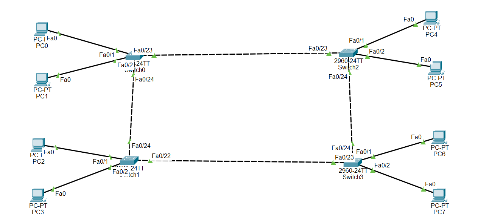

# Cisco Packet Tracer Lab - Rapid PVST (Spanning Tree Protocol)

## Objective

Learn how to configure Rapid Per-VLAN Spanning Tree (Rapid PVST+) on Cisco switches to prevent Layer 2 loops and control the Root Bridge election.

---

# What is Spanning Tree Protocol (STP)?

Spanning Tree Protocol (STP) is a Layer 2 protocol that prevents switching loops in Ethernet networks.

Without STP, redundant links between switches can create:

- Broadcast storms
- Duplicate frames
- MAC address table instability
- Network outages

STP solves this by placing redundant links into a blocking state while keeping them available as backup links.

---

# What is Rapid PVST+?

Rapid PVST+ (Rapid Per-VLAN Spanning Tree) is Cisco's implementation of Rapid Spanning Tree Protocol (RSTP).

Features include:

- Faster convergence than traditional STP
- A separate spanning tree for each VLAN
- Improved network performance
- Better redundancy

---

# Why Configure a Root Bridge?

The Root Bridge is the central switch used by STP to calculate the best paths through the network.

Benefits include:

- Predictable traffic flow
- Faster convergence
- Better network stability
- Efficient use of redundant links

---

# Root Primary

The Root Primary switch is the preferred Root Bridge.

Example:

```plaintext
spanning-tree vlan 10 root primary
```

Cisco automatically lowers the bridge priority so that the switch becomes the Root Bridge.

---

# Root Secondary

The Root Secondary switch acts as a backup Root Bridge.

Example:

```plaintext
spanning-tree vlan 10 root secondary
```

If the primary Root Bridge fails, the secondary switch can take over.

---

# Bridge Priority

Instead of using the `root primary` command, you can manually configure the bridge priority.

Example:

```plaintext
spanning-tree vlan 10 priority 8192
```

Lower priority values are preferred.

Default priority:

```text
32768
```

Valid values:

- 0
- 4096
- 8192
- 12288
- ...
- 61440

---

# PortFast

PortFast allows ports connected to end devices to move directly into the forwarding state without waiting for normal STP timers.

Example:

```plaintext
spanning-tree portfast
```

PortFast should only be enabled on access ports connected to end devices.

---

# BPDU Guard

BPDU Guard protects PortFast ports.

If a BPDU is received on a PortFast interface, the switch places the interface into an Err-Disabled state to prevent network loops.

Example:

```plaintext
spanning-tree bpduguard enable
```

---

# Configuration Commands

Enable Rapid PVST.

```plaintext
spanning-tree mode rapid-pvst
```

Configure Root Primary.

```plaintext
spanning-tree vlan 10 root primary
```

Configure Root Secondary.

```plaintext
spanning-tree vlan 10 root secondary
```

Configure PortFast.

```plaintext
spanning-tree portfast
```

Enable BPDU Guard.

```plaintext
spanning-tree bpduguard enable
```
## 🌐 Topology Screenshot



---

# Verification Commands

Display spanning tree information.

```plaintext
show spanning-tree
```

Display VLAN spanning tree.

```plaintext
show spanning-tree vlan 10
```

Display STP summary.

```plaintext
show spanning-tree summary
```

---

# Advantages

- Prevents Layer 2 loops
- Prevents broadcast storms
- Provides redundancy
- Faster convergence with Rapid PVST+
- Improves network stability
- Supports load balancing across VLANs

---

# Conclusion

Rapid PVST+ is a Cisco implementation of Rapid Spanning Tree Protocol that creates a separate spanning tree for each VLAN. By configuring a Root Primary, Root Secondary, PortFast, and BPDU Guard, network administrators can build stable, redundant, and highly available Layer 2 networks while preventing switching loops and minimizing downtime.