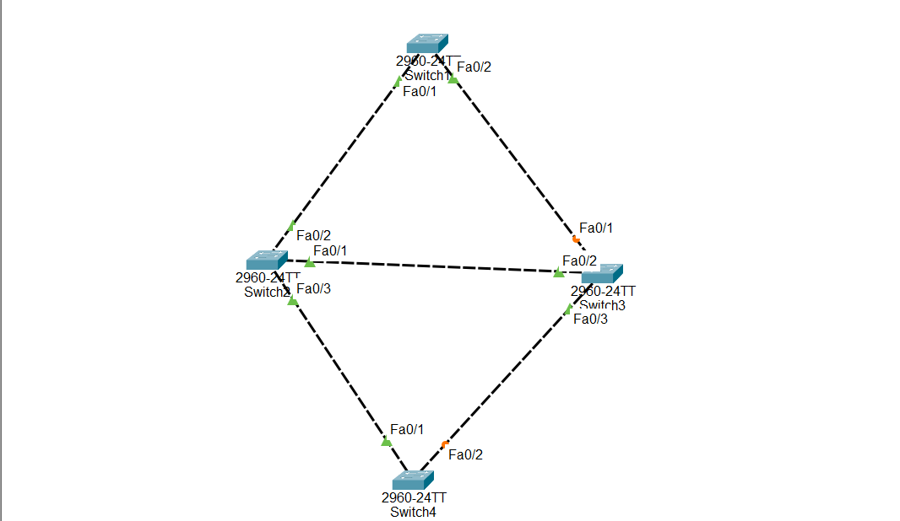

# Cisco Packet Tracer Lab - STP vs RSTP (Rapid PVST+)

## Objective

Learn the difference between Spanning Tree Protocol (STP) and Rapid Spanning Tree Protocol (RSTP) by configuring both on Cisco switches and observing how each protocol prevents Layer 2 loops.

---

# What is STP?

Spanning Tree Protocol (STP) is a Layer 2 protocol that prevents switching loops by blocking redundant paths between switches.

Without STP, redundant links can create:

- Broadcast storms
- Duplicate Ethernet frames
- MAC address table instability
- Network outages

STP elects one switch as the Root Bridge and blocks unnecessary links to create a loop-free topology.

IEEE Standard:

```
802.1D
```

---

# What is RSTP?

Rapid Spanning Tree Protocol (RSTP) is an improved version of STP.

RSTP provides much faster convergence after a network change while still preventing Layer 2 loops.

Cisco's implementation is called **Rapid PVST+**.

IEEE Standard:

```
802.1w
```

---

# STP vs RSTP

| Feature | STP | RSTP |
|---------|-----|------|
| IEEE Standard | 802.1D | 802.1w |
| Cisco Mode | PVST | Rapid PVST+ |
| Convergence Time | 30–50 seconds | 1–6 seconds |
| Port States | Blocking, Listening, Learning, Forwarding, Disabled | Discarding, Learning, Forwarding |
| Recovery Speed | Slow | Fast |

---

# Why Use STP?

STP helps to:

- Prevent switching loops
- Prevent broadcast storms
- Block redundant links
- Create a stable Layer 2 network

---

# Root Bridge

The Root Bridge is the central switch that STP uses to calculate the best paths through the network.

Configure the Root Bridge:

```plaintext
spanning-tree vlan 1 root primary
```

---

# Secondary Root Bridge

The Secondary Root Bridge serves as a backup.

If the Root Bridge fails, the Secondary Root Bridge can become the new Root Bridge.

Configure it using:

```plaintext
spanning-tree vlan 1 root secondary
```

---

# Configuration Commands

Enable STP (PVST):

```plaintext
spanning-tree mode pvst
```

Enable RSTP (Rapid PVST+):

```plaintext
spanning-tree mode rapid-pvst
```

Configure Root Primary:

```plaintext
spanning-tree vlan 1 root primary
```

Configure Root Secondary:

```plaintext
spanning-tree vlan 1 root secondary
```
## 🌐 Topology Screenshot



---

# Verification Commands

Display spanning tree information:

```plaintext
show spanning-tree
```

Display spanning tree information for VLAN 1:

```plaintext
show spanning-tree vlan 1
```

---

# What to Observe

After configuring STP:

- S1 becomes the Root Bridge.
- S2 becomes the Secondary Root Bridge.
- One redundant link is placed into the Blocking state to prevent loops.

After changing to Rapid PVST+:

- The topology remains loop-free.
- Network convergence after a topology change is much faster.

---

# Advantages of STP

- Prevents Layer 2 loops
- Prevents broadcast storms
- Supports redundant links

---

# Advantages of RSTP

- Faster convergence
- Reduced network downtime
- Improved performance
- Better scalability

---

# Conclusion

STP and RSTP both protect Layer 2 networks from loops by blocking redundant paths. The main difference is speed: STP (IEEE 802.1D) converges slowly, while RSTP (IEEE 802.1w), implemented by Cisco as Rapid PVST+, converges much faster. For modern networks, RSTP is generally preferred because it restores connectivity more quickly after a link or switch failure.