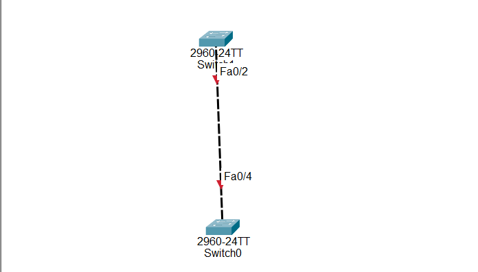

# 🔐 BPDU Guard Configuration in Cisco Switches

## What is BPDU Guard?

BPDU Guard is a Cisco **Spanning Tree Protocol (STP) security feature** that protects switch access ports from unauthorized switch connections.

It is used on switch ports configured with **PortFast** and connected to end devices such as:

- PCs
- Laptops
- Printers
- IP phones

STP uses BPDUs (Bridge Protocol Data Units) to exchange information between switches. If an unexpected switch is connected to an access port, it sends BPDUs.

When BPDU Guard detects a BPDU on a protected port, it immediately places the port into **error-disabled state** to protect the network.

---

# BPDU Guard is used to:

- Prevent unauthorized switches from connecting to access ports

- Protect the STP topology from unwanted changes

- Prevent rogue switches from affecting the Root Bridge

- Avoid accidental Layer 2 loops

- Improve network security

- Protect user access ports

---

# Important Notes:

BPDU Guard is normally configured on:

- Access ports

- Ports connected to end devices

- Ports configured with PortFast


Example:

```
PC
 |
 |
Switch Access Port
```

The PC does not send BPDUs.

---

BPDU Guard should not normally be configured on:

- Trunk ports

- Switch-to-switch links

Example:

```
Switch A -------- Switch B
```

These ports need BPDUs for STP operation.

---

# Why BPDU Guard is Important

Without BPDU Guard:

```
Normal Switch
      |
      |
User Access Port
      |
Rogue Switch
```

The new switch can send BPDUs and affect the STP topology.

Possible problems:

- A new switch becomes Root Bridge

- STP recalculates

- Network traffic can be interrupted

---

With BPDU Guard:

```
Rogue Switch
      |
      |
Access Port
      |
BPDU Detected
      |
Port Shutdown
```

The switch port becomes disabled and prevents the rogue switch from joining the network.

---

# BPDU Guard vs Root Guard

Both features protect STP, but they work differently.

---

## BPDU Guard

Purpose:

Prevent any switch from connecting to an access port.

When any BPDU is received:

- Port goes into error-disabled state

- Connection is blocked

Used on:

- Access ports

Example:

```
PC Port + BPDU Guard
```

---

## Root Guard

Purpose:

Protect the current Root Bridge.

It allows another switch to connect, but prevents it from becoming Root Bridge.

It blocks only:

- Superior BPDUs

Used on:

- Switch-to-switch ports

Example:

```
Switch A (Root Bridge)
        |
        |
Switch B
```

If Switch B tries to become Root, Root Guard blocks it.

---

# BPDU Guard vs BPDU Filter

## BPDU Guard

- Detects BPDUs

- Shuts down the port

- Used for access ports

Example:

```
BPDU received → Port shutdown
```

---

## BPDU Filter

- Stops BPDU transmission and reception

- Prevents a port from participating in STP

- Used carefully because it can create loops

Example:

```
No BPDU communication
```

---

# Step-by-Step BPDU Guard Configuration

## Step 1 — Enter Global Configuration Mode

```
Switch> enable

Switch# configure terminal
```

---

# Step 2 — Enable PortFast on the Access Port

Example: FastEthernet 0/4

```
Switch(config)# interface fastEthernet 0/4

Switch(config-if)# spanning-tree portfast
```

PortFast allows the port to immediately move to forwarding state.

---

# Step 3 — Enable BPDU Guard on the Interface

```
Switch(config-if)# spanning-tree bpduguard enable
```

The port is now protected.

---

# Step 4 — Enable BPDU Guard Globally

Instead of configuring every interface manually:

```
Switch(config)# spanning-tree portfast bpduguard default
```

This enables BPDU Guard automatically on all PortFast interfaces.

---

# Step 5 — Save Configuration

```
Switch(config-if)# end

Switch# copy running-config startup-config
```

---

## 🌐 Topology Screenshot



---

# 🎯 Packet Tracer Tasks

## Task 1 — Configure BPDU Guard on Fa0/4

Requirements:

- Configure Fa0/4 as an access port

- Enable PortFast

- Enable BPDU Guard


Commands:

```
interface fastEthernet 0/4

switchport mode access

spanning-tree portfast

spanning-tree bpduguard enable
```

---

# Task 2 — Test BPDU Guard Protection

Requirements:

1. Connect PC1 to Fa0/4

2. Verify the port is working

3. Disconnect PC1

4. Connect another switch to Fa0/4

5. Check the port status


Expected result:

- The switch sends BPDUs

- BPDU Guard detects the BPDU

- Fa0/4 changes to error-disabled state

---

# Task 3 — Enable BPDU Guard Globally

Requirements:

Enable BPDU Guard automatically on all PortFast ports.


Command:

```
spanning-tree portfast bpduguard default
```

---

# Verification Commands

## Check Spanning Tree Interface Details

Example:

```
show spanning-tree interface fastEthernet 0/4 detail
```

Expected output:

```
The port is in the portfast mode

Bpdu guard is enabled
```

---

## Check Interface Status

```
show interfaces status
```

Example output after violation:

```
Fa0/4     err-disabled
```

---

## Check Running Configuration

```
show running-config
```

---

## Check Error Disabled Ports

```
show interfaces status err-disabled
```

---

# Expected Result

After configuration:

✅ Access ports are protected from unauthorized switches

✅ BPDU messages are detected

✅ Rogue switches cannot join the network

✅ Ports receiving BPDUs enter error-disabled state

✅ STP topology remains protected

---

# Conclusion

BPDU Guard is an important Cisco STP security feature used to protect access ports from unwanted switch connections.

It prevents unauthorized switches from affecting the Spanning Tree topology by shutting down ports that receive unexpected BPDUs.

BPDU Guard is commonly used with **PortFast on access ports** in enterprise networks.