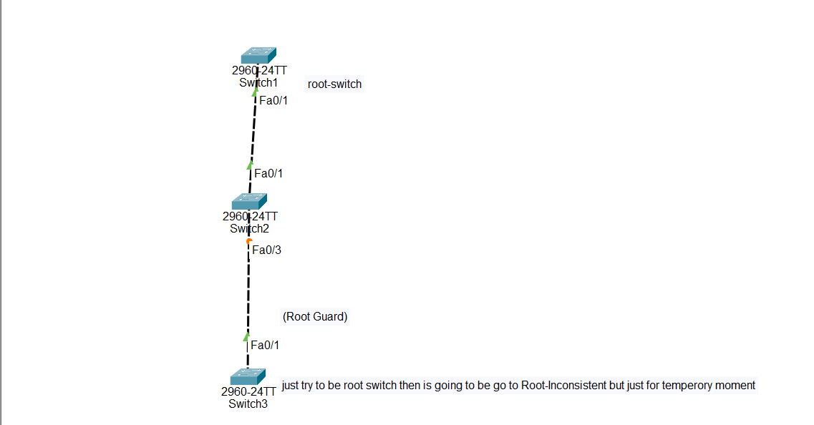

# 🔐 Root Guard Configuration in Cisco Switches

## What is Root Guard?

Root Guard is a Cisco **Spanning Tree Protocol (STP) security feature** that prevents another switch from becoming the Root Bridge.

In STP, the switch with the best Bridge ID becomes the Root Bridge.

Sometimes, an unwanted switch may send a **superior BPDU** and try to become the new Root Bridge.

Root Guard prevents this by blocking superior BPDUs from specific switch ports.

---

# Root Guard is used to:

- Protect the current Root Bridge

- Prevent unauthorized switches from becoming Root Bridge

- Control STP Root Bridge elections

- Prevent unexpected STP topology changes

- Improve Layer 2 network stability

---

# Important Notes:

Root Guard is configured on:

- Switch-to-switch ports

- Ports where you do not want the connected switch to become Root Bridge

Example:

```
Switch A
(Root Bridge)
      |
      |
Fa0/3
      |
Switch B
```

Root Guard is configured on the port facing Switch B.

---

Root Guard is NOT normally configured on:

- PC ports

- Printer ports

- User access ports

Example:

```
PC -------- Switch
```

For user ports, use **BPDU Guard**.

---

# Why Root Guard is Important

Without Root Guard:

```
             Switch A
          (Current Root)
                |
                |
             Switch B
                |
                |
             Switch X
```

Switch X sends a superior BPDU:

```
"I have a better Bridge ID.
I should become Root Bridge."
```

STP may change:

```
Old Root:
Switch A

New Root:
Switch X
```

This can cause network instability.

---

With Root Guard:

```
Switch A
(Root Bridge)
      |
      |
Fa0/3
(Root Guard)
      |
Switch X
```

Switch X sends superior BPDU.

Root Guard blocks it.

Result:

```
Fa0/3 → Root-Inconsistent State
```

Switch X cannot become Root Bridge.

---

# What is a Superior BPDU?

A superior BPDU is a BPDU that contains better Root Bridge information.

It means:

> "I should become the new Root Bridge."

STP compares Bridge IDs.

The switch with the lowest Bridge ID wins.

---

# Root Guard vs BPDU Guard

| Root Guard | BPDU Guard |
|------------|------------|
| Protects Root Bridge | Protects access ports |
| Used between switches | Used toward end devices |
| Allows switch connection | Blocks switch connection |
| Blocks superior BPDUs only | Blocks all BPDUs |
| Port enters root-inconsistent state | Port enters error-disabled state |

---

# Step-by-Step Root Guard Configuration

## Step 1 — Enter Enable Mode

```
Switch> enable
```

---

## Step 2 — Enter Global Configuration Mode

```
Switch# configure terminal
```

---

## Step 3 — Select the Interface

Example:

Configure FastEthernet 0/3

```
Switch(config)# interface fastEthernet 0/3
```

---

## Step 4 — Enable Root Guard

```
Switch(config-if)# spanning-tree guard root
```

This prevents the connected switch from becoming Root Bridge.

---

## Step 5 — Save Configuration

```
Switch(config-if)# end

Switch# copy running-config startup-config
```

---

## 🌐 Topology Screenshot



# 🎯 Packet Tracer Tasks

# Task 1 — Configure Switch A as Root Bridge

Requirements:

- Make Switch A the Root Bridge for VLAN 1


Commands:

```
SwitchA> enable

SwitchA# configure terminal

SwitchA(config)# spanning-tree vlan 1 root primary
```

---

# Task 2 — Configure Root Guard on Switch B

Requirements:

- Prevent Switch X from becoming Root Bridge

Configure the interface connected to Switch X.


Commands:

```
SwitchB> enable

SwitchB# configure terminal

SwitchB(config)# interface fastEthernet 0/3

SwitchB(config-if)# spanning-tree guard root
```

---

# Task 3 — Test Root Guard

Requirements:

1. Connect Switch X to Switch B.

2. Configure Switch X with a lower bridge priority.

Example:

```
SwitchX(config)# spanning-tree vlan 1 priority 4096
```

3. Check STP status.


Expected Result:

- Switch X sends superior BPDU.

- Root Guard blocks the BPDU.

- The port enters root-inconsistent state.

- Switch A remains the Root Bridge.

---

# Verification Commands

## Check Root Bridge

```
show spanning-tree
```

---

## Check Root Guard Ports

```
show spanning-tree inconsistentports
```

Expected output:

```
Interface Fa0/3
Root Inconsistent
```

---

## Check Interface Status

```
show spanning-tree interface fa0/3 detail
```

---

## Check Running Configuration

```
show running-config
```

---

# Expected Result

After configuration:

✅ Switch A remains the Root Bridge

✅ Switch X cannot become Root Bridge

✅ Superior BPDUs are blocked

✅ STP topology remains stable

✅ Root Guard protects the network from unwanted STP changes

---

# Conclusion

Root Guard is an important Cisco STP security feature used to control Root Bridge elections.

It allows switches to participate in STP but prevents them from becoming the Root Bridge.

Root Guard is commonly configured on switch-to-switch links where the administrator wants to control the STP topology.