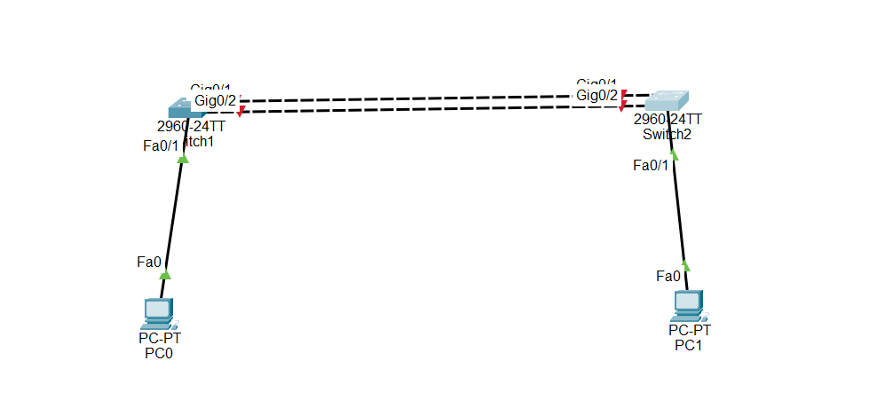

# 🔗 LACP (Link Aggregation Control Protocol) Configuration in Cisco Switches

## What is LACP?

LACP (Link Aggregation Control Protocol) is a Layer 2 protocol that combines multiple physical Ethernet links into one logical link called a **Port-Channel (EtherChannel)**.

Instead of using one cable between two switches, LACP allows multiple cables to work together as one connection.

This increases bandwidth and provides redundancy. If one cable fails, the remaining cables continue carrying traffic.

---

# LACP is used to:

- Combine multiple physical links into one logical link.
- Increase bandwidth.
- Provide link redundancy.
- Prevent single-link failure.
- Improve network performance.

---

# Important Notes

- LACP is an IEEE standard (802.3ad / 802.1AX).
- At least one side must use **mode active**.
- Both switches must use LACP.
- All bundled interfaces must have the same speed and duplex.
- All interfaces must have the same switchport configuration.
- A Port-Channel interface is created automatically after assigning interfaces to the same channel-group.

---

# Why LACP is Important

- Increases network bandwidth.
- Provides redundancy.
- Improves network availability.
- Prevents network downtime if one cable fails.
- Commonly used between switches and servers.

---

# 🎯 Packet Tracer Task

Create an LACP EtherChannel between two Cisco switches.

## Requirements

- Configure two Cisco 2960 switches.
- Connect the switches using two Gigabit Ethernet cables.
- Use GigabitEthernet0/1 and GigabitEthernet0/2.
- Configure LACP using **mode active**.
- Configure the Port-Channel as a trunk.
- Allow VLANs 10,20,30.
- Verify the EtherChannel configuration.

---

# Configuration Steps

## Step 1 – Create VLANs

On **both switches**

```
enable

configure terminal

vlan 10
name SALES

vlan 20
name HR

vlan 30
name IT
```

---

## Step 2 – Configure Physical Interfaces

On **Switch1**

```
interface range gigabitEthernet0/1 - 2

channel-group 1 mode active

no shutdown
```

On **Switch2**

```
interface range gigabitEthernet0/1 - 2

channel-group 1 mode active

no shutdown
```

---

## Step 3 – Configure the Port-Channel

On **both switches**

```
interface port-channel 1

switchport mode trunk

switchport trunk allowed vlan 10,20,30
```

---

## Step 4 – Save Configuration

```
end

copy running-config startup-config
```

---

# 🌐 Topology Screenshot




# Verification

Display EtherChannel summary.

```
show etherchannel summary
```

Display Port-Channel information.

```
show interfaces port-channel 1
```

Display trunk information.

```
show interfaces trunk
```

Display running configuration.

```
show running-config
```

---

# Expected Result

After configuration:

- Two physical links become one logical Port-Channel.
- Traffic is load-balanced across both links.
- If one cable fails, communication continues through the remaining cable.
- VLANs 10, 20, and 30 pass through the EtherChannel trunk.
- The EtherChannel status shows **SU** (Layer 2 and In Use).

---

# Conclusion

LACP is a Layer 2 protocol that combines multiple physical links into one logical Port-Channel. It increases bandwidth, provides redundancy, improves network performance, and is widely used in enterprise networks to connect switches and servers.