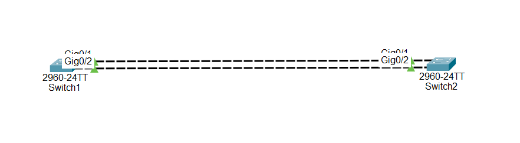

# Cisco Packet Tracer Lab - PAgP (Port Aggregation Protocol)

## Objective

Learn how to configure PAgP (Port Aggregation Protocol) on Cisco switches to bundle multiple physical links into a single logical EtherChannel, providing increased bandwidth and redundancy.

---

# What is PAgP?

PAgP (Port Aggregation Protocol) is a Cisco proprietary protocol used to automatically create an EtherChannel between two Cisco switches.

Instead of using two separate physical links, PAgP combines them into one logical interface called a **Port-Channel**.

---

# PAgP is used to:

- Increase bandwidth
- Provide link redundancy
- Balance network traffic
- Simplify network management
- Improve network performance

---

# Important Notes

- PAgP only works between Cisco devices.
- Both switches must support PAgP.
- All interfaces in the EtherChannel must have identical configurations.
- Interfaces must have the same:
  - Speed
  - Duplex
  - Switchport mode (Access or Trunk)
  - Allowed VLANs (if configured as trunks)
- One side should be configured as **desirable**.
- The other side can be **desirable** or **auto**.

---

# PAgP Modes

## Desirable

The switch actively tries to create the EtherChannel.

Example:

```plaintext
channel-group 1 mode desirable
```

---

## Auto

The switch waits for the other switch to start the negotiation.

Example:

```plaintext
channel-group 1 mode auto
```

---

# Valid PAgP Combinations

| Switch A | Switch B | Result |
|-----------|-----------|--------|
| desirable | desirable | ✅ Works |
| desirable | auto | ✅ Works |
| auto | auto | ❌ Does Not Work |

---

# Step-by-Step Configuration

## Step 1 — Configure Physical Interfaces on Switch 1

```plaintext
Switch> enable

Switch# configure terminal

Switch(config)# interface range gigabitEthernet0/1-2

Switch(config-if-range)# switchport mode trunk

Switch(config-if-range)# channel-protocol pagp

Switch(config-if-range)# channel-group 1 mode desirable

Switch(config-if-range)# no shutdown
```

---

## Step 2 — Configure Physical Interfaces on Switch 2

```plaintext
Switch> enable

Switch# configure terminal

Switch(config)# interface range gigabitEthernet0/1-2

Switch(config-if-range)# switchport mode trunk

Switch(config-if-range)# channel-protocol pagp

Switch(config-if-range)# channel-group 1 mode auto

Switch(config-if-range)# no shutdown
```

---

## Step 3 — Configure the Port-Channel on Both Switches

```plaintext
Switch(config)# interface port-channel 1

Switch(config-if)# switchport mode trunk

Switch(config-if)# switchport trunk allowed vlan 10,20,30
```

---

## Step 4 — Save the Configuration

```plaintext
Switch(config-if)# end

Switch# copy running-config startup-config
```

---

# 🌐 Topology Screenshot



---

# 🎯 Packet Tracer Tasks

## Task 1 — Configure PAgP on Switch 1

Requirements:

- Configure Gi0/1 and Gi0/2
- Use trunk mode
- Enable PAgP
- Use desirable mode
- Create EtherChannel Group 1

Commands:

```plaintext
interface range gigabitEthernet0/1-2

switchport mode trunk

channel-protocol pagp

channel-group 1 mode desirable

no shutdown
```

---

## Task 2 — Configure PAgP on Switch 2

Requirements:

- Configure Gi0/1 and Gi0/2
- Use trunk mode
- Enable PAgP
- Use auto mode
- Join EtherChannel Group 1

Commands:

```plaintext
interface range gigabitEthernet0/1-2

switchport mode trunk

channel-protocol pagp

channel-group 1 mode auto

no shutdown
```

---

## Task 3 — Configure the Port-Channel

Requirements:

- Configure Port-Channel 1
- Configure trunk mode
- Allow VLANs 10,20,30

Commands:

```plaintext
interface port-channel 1

switchport mode trunk

switchport trunk allowed vlan 10,20,30
```

---

## Task 4 — Verify the EtherChannel

Requirements:

- Verify that Port-Channel 1 is created.
- Verify that Gi0/1 and Gi0/2 are members of the EtherChannel.
- Verify that the protocol is PAgP.

Commands:

```plaintext
show etherchannel summary
```

```plaintext
show interfaces port-channel 1
```

```plaintext
show interfaces status
```

```plaintext
show running-config
```

---

# Expected Result

After configuration:

✅ Gi0/1 and Gi0/2 are successfully bundled into Port-Channel 1.

✅ The EtherChannel is established using PAgP.

✅ VLANs 10, 20, and 30 are allowed across the trunk.

✅ Traffic is balanced across both physical links.

✅ If one cable fails, the other link continues forwarding traffic.

---

# Advantages

- Increases bandwidth
- Provides link redundancy
- Supports load balancing
- Improves network reliability
- Simplifies switch management
- Reduces network congestion

---

# Conclusion

PAgP (Port Aggregation Protocol) is a Cisco proprietary protocol used to automatically create an EtherChannel between Cisco switches. By bundling multiple physical links into one logical Port-Channel, administrators can increase bandwidth, improve redundancy, and simplify network management while maintaining reliable Layer 2 connectivity.