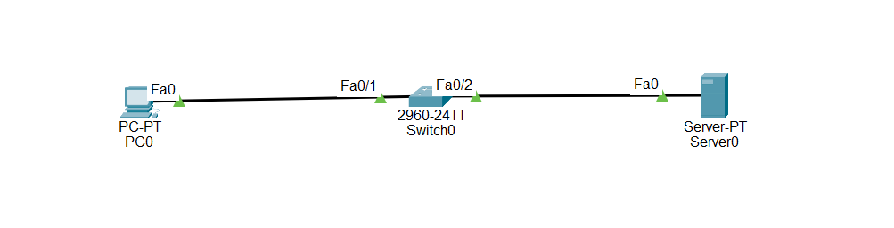

# Cisco Packet Tracer Lab - Syslog Configuration on Cisco Switch

## Objective

Learn how to configure Syslog on a Cisco switch to send log messages to a central Syslog server for monitoring, troubleshooting, and network management.

---

# What is Syslog?

Syslog (System Logging) is a network service used to collect and store log messages from network devices such as switches, routers, firewalls, and servers.

Instead of keeping logs only on the switch, Syslog sends them to a central Syslog server where administrators can monitor the entire network from one location.

---

# Syslog is used to:

- Monitor network devices
- Troubleshoot network problems
- Record configuration changes
- Detect security events
- Store logs in one central location

---

# Important Notes

- Syslog uses **UDP Port 514** by default.
- A Syslog server must have an IP address.
- The switch must know the IP address of the Syslog server.
- Syslog messages are classified into severity levels (0–7).
- Lower numbers indicate more serious events.
- Timestamps make troubleshooting much easier.

---

# Why Syslog is Important

- Centralizes log messages from multiple devices.
- Helps identify network problems quickly.
- Records configuration changes.
- Improves network monitoring.
- Commonly used in enterprise networks.

---

# Syslog Severity Levels

| Level | Name | Description |
|--------|----------------|------------------------------|
| 0 | Emergencies | System is unusable |
| 1 | Alerts | Immediate action required |
| 2 | Critical | Critical conditions |
| 3 | Errors | Error conditions |
| 4 | Warnings | Warning messages |
| 5 | Notifications | Normal but important events |
| 6 | Informational | General information |
| 7 | Debugging | Debugging messages |

---

# Configuration Steps

## Step 1 — Configure the Devices

Place the following devices in Cisco Packet Tracer:

- 1 Cisco 2960 Switch
- 1 Server (Syslog Server)
- 1 PC

Connect:

- PC → Switch Fa0/2
- Server → Switch Fa0/1

Assign IP addresses.

Example:

Server

```plaintext
IP Address: 192.168.1.100
Subnet Mask: 255.255.255.0
```

Switch VLAN 1

```plaintext
IP Address: 192.168.1.2
Subnet Mask: 255.255.255.0
```

PC

```plaintext
IP Address: 192.168.1.10
Subnet Mask: 255.255.255.0
Default Gateway: 192.168.1.2
```

---

## Step 2 — Configure the Switch Management IP

```plaintext
enable

configure terminal

interface vlan 1

ip address 192.168.1.2 255.255.255.0

no shutdown

exit
```

---

## Step 3 — Enable Logging

```plaintext
logging on
```

---

## Step 4 — Configure the Syslog Server

Replace the IP address with your server's IP.

```plaintext
logging host 192.168.1.100
```

---

## Step 5 — Configure the Logging Severity

```plaintext
logging trap notifications
```

This sends severity levels **0–5** to the Syslog server.

---

## Step 6 — Configure the Source Interface

```plaintext
logging source-interface vlan 1
```

The switch will use VLAN 1's IP address when sending log messages.

---

## Step 7 — Enable Timestamps

```plaintext
service timestamps log datetime msec
```

Every log message will include the date and time.

---

## Step 8 — Save the Configuration

```plaintext
end

copy running-config startup-config
```

---

## 🌐 Topology Screenshot



---

# 🎯 Packet Tracer Tasks

## Task 1 — Configure the Switch

Requirements:

- Configure VLAN 1.
- Assign IP address 192.168.1.2.
- Enable logging.

Commands

```plaintext
interface vlan 1

ip address 192.168.1.2 255.255.255.0

no shutdown

logging on
```

---

## Task 2 — Configure the Syslog Server

Requirements:

- Configure the server IP address.
- Configure the switch to send logs to the server.

Commands

```plaintext
logging host 192.168.1.100
```

---

## Task 3 — Configure Logging Options

Requirements:

- Send Notification-level logs.
- Use VLAN 1 as the source interface.
- Enable timestamps.

Commands

```plaintext
logging trap notifications

logging source-interface vlan 1

service timestamps log datetime msec
```

---

## Task 4 — Generate Log Messages

Perform one or more of the following:

- Shut down an interface.
- Enable an interface.
- Enter and exit configuration mode.
- Save the running configuration.

These events should generate Syslog messages.

---

# Verification Commands

Display Syslog configuration.

```plaintext
show logging
```

Display the running configuration.

```plaintext
show running-config
```

Display interface status.

```plaintext
show interfaces status
```

---

# Expected Result

After configuration:

✅ Logging is enabled.

✅ The switch sends log messages to the Syslog server.

✅ The Syslog server receives events generated by the switch.

✅ Log messages include timestamps.

✅ VLAN 1 is used as the source interface.

---

# Advantages

- Centralized log management.
- Easier troubleshooting.
- Better network monitoring.
- Improved security auditing.
- Records network events for future analysis.

---

# Conclusion

Syslog is an important network monitoring service that allows Cisco switches to send log messages to a central Syslog server. By configuring a Syslog server, selecting the appropriate logging severity, using a source interface, and enabling timestamps, administrators can monitor network activity, troubleshoot problems, and improve the overall security and reliability of the network.