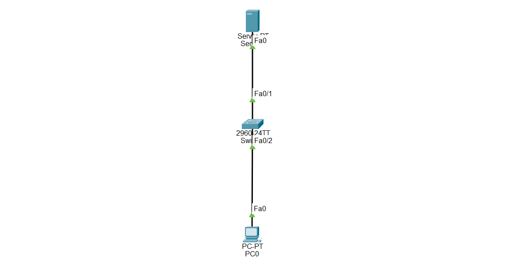

# Cisco Packet Tracer Lab - SNMP Configuration on Cisco Switch

## Objective

Learn how to configure Simple Network Management Protocol (SNMP) on a Cisco switch to allow a Network Management System (NMS) to monitor and manage the switch.

---

# What is SNMP?

SNMP (Simple Network Management Protocol) is a network management protocol used to monitor and manage network devices such as switches, routers, servers, printers, and firewalls.

Instead of logging in to every device individually, a network administrator can monitor all devices from one central management server.

---

# SNMP is used to:

- Monitor network devices
- Collect device information
- Monitor interface status
- Monitor CPU and memory usage
- Receive alerts when network events occur
- Manage devices from a central location

---

# Important Notes

- SNMP uses **UDP Port 161** for communication.
- SNMP Traps use **UDP Port 162**.
- SNMPv2c uses Community Strings as passwords.
- SNMPv3 uses usernames, authentication, and encryption.
- SNMPv3 is much more secure than SNMPv2c.
- SNMP Manager (NMS) collects information from network devices.

---

# Why SNMP is Important

- Centralized network monitoring.
- Easier troubleshooting.
- Monitors device performance.
- Sends automatic alerts.
- Improves network management.
- Commonly used in enterprise networks.

---

# SNMP Versions

## SNMPv1

- Oldest version
- Uses Community Strings
- No encryption

---

## SNMPv2c

- Improved performance
- Uses Community Strings
- No encryption
- Suitable for trusted internal networks

---

## SNMPv3

- Most secure version
- Uses usernames
- Authentication
- Encryption (Privacy)
- Recommended for production networks

---

# Configuration Steps

## Step 1 — Configure the Devices

Place the following devices in Cisco Packet Tracer:

- 1 Cisco 2960 Switch
- 1 Server (Network Management Station)
- 1 PC

Connect:

- Server → Switch Fa0/1
- PC → Switch Fa0/2

Assign IP addresses.

Example:

Server

```plaintext
IP Address: 192.168.1.100
Subnet Mask: 255.255.255.0
```

Switch VLAN 1

```plaintext
IP Address: 192.168.1.2
Subnet Mask: 255.255.255.0
```

PC

```plaintext
IP Address: 192.168.1.10
Subnet Mask: 255.255.255.0
Default Gateway: 192.168.1.2
```

---

## Step 2 — Configure the Switch Management IP

```plaintext
enable

configure terminal

interface vlan 1

ip address 192.168.1.2 255.255.255.0

no shutdown

exit
```

---

# SNMPv2c Configuration

## Step 3 — Configure the Community String

```plaintext
snmp-server community Network123 RO
```

This creates a Read-Only community string named **Network123**.

---

## Step 4 — Configure the SNMP Manager

Replace the IP address with your NMS server.

```plaintext
snmp-server host 192.168.1.100 version 2c Network123
```

---

## Step 5 — Enable SNMP Traps

```plaintext
snmp-server enable traps
```

The switch will automatically send notifications to the SNMP Manager.

---

# SNMPv3 Configuration

## Step 6 — Create an SNMP View

```plaintext
snmp-server view MYVIEW mib-2 included
```

---

## Step 7 — Create an SNMP Group

```plaintext
snmp-server group MYGROUP v3 auth priv read MYVIEW
```

---

## Step 8 — Create an SNMP User

```plaintext
snmp-server user admin MYGROUP v3 auth sha Cisco123 priv aes 128 Cisco123
```

---

## Step 9 — Save the Configuration

```plaintext
end

copy running-config startup-config
```

---

## 🌐 Topology Screenshot



---

# 🎯 Packet Tracer Tasks

## Task 1 — Configure the Switch

Requirements:

- Configure VLAN 1.
- Assign IP address **192.168.1.2**.
- Enable the management interface.

Commands

```plaintext
interface vlan 1

ip address 192.168.1.2 255.255.255.0

no shutdown
```

---

## Task 2 — Configure SNMPv2c

Requirements:

- Configure a Read-Only community string.
- Configure the Network Management Server.
- Enable SNMP traps.

Commands

```plaintext
snmp-server community Network123 RO

snmp-server host 192.168.1.100 version 2c Network123

snmp-server enable traps
```

---

## Task 3 — Configure SNMPv3

Requirements:

- Create an SNMP View.
- Create an SNMP Group.
- Create an SNMP User with authentication and encryption.

Commands

```plaintext
snmp-server view MYVIEW mib-2 included

snmp-server group MYGROUP v3 auth priv read MYVIEW

snmp-server user admin MYGROUP v3 auth sha Cisco123 priv aes 128 Cisco123
```

---

## Task 4 — Verify the Configuration

Requirements:

Verify that the SNMP configuration has been successfully applied.

Commands

```plaintext
show snmp community

show snmp user

show running-config | include snmp
```

---

# Verification Commands

Display SNMP community strings.

```plaintext
show snmp community
```

Display SNMP users.

```plaintext
show snmp user
```

Display SNMP configuration.

```plaintext
show running-config | include snmp
```

Display interface status.

```plaintext
show interfaces status
```

---

# Expected Result

After configuration:

✅ SNMP is enabled.

✅ The Network Management Server can monitor the switch.

✅ SNMPv2c uses a Read-Only community string.

✅ SNMPv3 provides secure authentication and encryption.

✅ SNMP traps are sent automatically to the monitoring server.

---

# Advantages

- Centralized device monitoring.
- Easier troubleshooting.
- Secure management with SNMPv3.
- Automatic event notifications.
- Improved network administration.
- Widely used in enterprise networks.

---

# Conclusion

SNMP is a network management protocol that allows administrators to monitor and manage Cisco switches from a central Network Management System (NMS). SNMPv2c provides simple monitoring using community strings, while SNMPv3 adds authentication and encryption for improved security. By configuring SNMP, administrators can monitor network performance, receive automatic alerts, and efficiently manage enterprise networks.