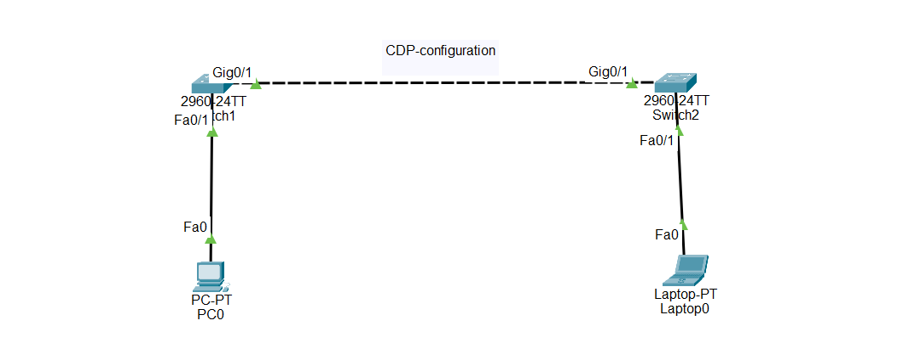

# Cisco Packet Tracer Lab - Cisco Discovery Protocol (CDP) Configuration

## Objective

Learn how to configure Cisco Discovery Protocol (CDP) on Cisco switches to discover directly connected Cisco devices and display neighbor information for network monitoring and troubleshooting.

---

# What is Cisco Discovery Protocol (CDP)?

Cisco Discovery Protocol (CDP) is a Cisco proprietary Layer 2 protocol used by Cisco devices to discover directly connected Cisco devices.

Instead of manually checking physical connections, administrators can use CDP to automatically identify neighboring Cisco devices and gather useful information about them.

---

# CDP is used to:

- Discover neighboring Cisco devices
- Display neighbor IP addresses
- View connected interfaces
- Display Cisco IOS versions
- Display device models
- Troubleshoot physical connections

---

# Important Notes

- CDP is enabled by default on Cisco devices.
- CDP works only between Cisco devices.
- CDP operates at Layer 2 (Data Link Layer).
- CDP advertisements are sent every **60 seconds** by default.
- Neighbor information is stored for **180 seconds** by default.
- CDP does not work across routers.

---

# Why CDP is Important

- Automatically discovers Cisco devices.
- Makes troubleshooting easier.
- Displays interface information.
- Verifies physical connections.
- Helps identify neighboring devices.
- Commonly used in enterprise networks.

---

# Configuration Steps

## Step 1 — Configure the Devices

Place the following devices in Cisco Packet Tracer:

- 2 Cisco 2960 Switches
- 1 PC
- 1 Laptop

Connect:

- Switch1 Gi0/1 → Switch2 Gi0/1
- PC → Switch1 Fa0/1
- Laptop → Switch2 Fa0/1

Assign hostnames.

Example

Switch 1

```plaintext
Hostname: Switch1
```

Switch 2

```plaintext
Hostname: Switch2
```

---

## Step 2 — Enable CDP Globally

On both switches

```plaintext
enable

configure terminal

cdp run
```

---

## Step 3 — Enable CDP on the Switch-to-Switch Interface

```plaintext
interface gigabitEthernet0/1

cdp enable
```

---

## Step 4 — Disable CDP on the PC Port (Optional)

Since PCs do not support CDP, disable CDP on the access port.

```plaintext
interface fastEthernet0/1

no cdp enable
```

---

## Step 5 — Change the CDP Timer (Optional)

```plaintext
cdp timer 30
```

The switch will send CDP advertisements every **30 seconds**.

---

## Step 6 — Change the Holdtime (Optional)

```plaintext
cdp holdtime 120
```

Neighbor information will be kept for **120 seconds**.

---

## Step 7 — Save the Configuration

```plaintext
end

copy running-config startup-config
```

---

## 🌐 Topology Screenshot



---

# 🎯 Packet Tracer Tasks

---

## Task 2 — Enable CDP

Requirements:

- Enable CDP globally.
- Enable CDP on GigabitEthernet0/1.

Commands

```plaintext
enable

configure terminal

cdp run

interface gigabitEthernet0/1

cdp enable

end
```

---

## Task 3 — Disable CDP on End Device Ports

Requirements:

- Disable CDP on the PC port.

Commands

```plaintext
configure terminal

interface fastEthernet0/1

no cdp enable

end
```

---

## Task 4 — Configure CDP Timers

Requirements:

- Change the CDP timer to 30 seconds.
- Change the holdtime to 120 seconds.

Commands

```plaintext
configure terminal

cdp timer 30

cdp holdtime 120

end
```

---

## Task 5 — Verify the Configuration

Requirements:

Verify that CDP is working correctly and both switches discover each other.

Commands

```plaintext
show cdp
```

```plaintext
show cdp neighbors
```

```plaintext
show cdp neighbors detail
```

```plaintext
show cdp interface
```

---

# Verification Commands

Display CDP status.

```plaintext
show cdp
```

Display neighboring Cisco devices.

```plaintext
show cdp neighbors
```

Display detailed neighbor information.

```plaintext
show cdp neighbors detail
```

Display CDP interface information.

```plaintext
show cdp interface
```

---

# Expected Result

After configuration:

✅ CDP is enabled globally.

✅ Switch1 discovers Switch2.

✅ Switch2 discovers Switch1.

✅ Neighbor information displays hostname, IP address, interfaces, platform, and IOS version.

✅ PC ports do not send CDP advertisements.

---

# Advantages

- Automatically discovers neighboring Cisco devices.
- Simplifies troubleshooting.
- Displays device information.
- Verifies physical connections.
- Reduces network administration time.
- Widely used in Cisco enterprise networks.

---

# Conclusion

Cisco Discovery Protocol (CDP) is a Cisco proprietary Layer 2 protocol that automatically discovers directly connected Cisco devices. By configuring CDP, enabling it on switch interfaces, adjusting timers, and verifying neighbor information, administrators can quickly identify connected devices, troubleshoot network issues, and simplify network management.

---


## Devices

- 2 × Cisco 2960 Switches
- 1 × PC
- 1 × Laptop

## Connections

| Device | Port | Connected To | Port |
|---------|------|--------------|------|
| Switch1 | Gi0/1 | Switch2 | Gi0/1 |
| Switch1 | Fa0/1 | PC | Fa0 |
| Switch2 | Fa0/1 | Laptop | Fa0 |
