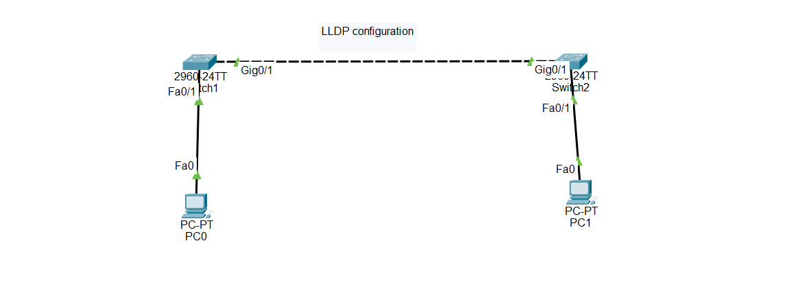

# Cisco Packet Tracer Lab - LLDP (Link Layer Discovery Protocol) Configuration on Cisco Switch

## Objective

Learn how to configure Link Layer Discovery Protocol (LLDP) on a Cisco switch to discover directly connected network devices and exchange device information.

---

# What is LLDP?

LLDP (Link Layer Discovery Protocol) is an open-standard Layer 2 discovery protocol used by network devices to advertise information about themselves to directly connected neighbors.

Unlike CDP, LLDP works between devices from different vendors such as Cisco, Juniper, HP, Aruba, Huawei, and Dell.

---

# LLDP is used to:

- Discover neighboring devices
- Display device information
- Troubleshoot network connections
- Verify physical network topology
- Support multi-vendor networks

---

# Important Notes

- LLDP is an IEEE standard (802.1AB).
- LLDP works at Layer 2 (Data Link Layer).
- LLDP must be enabled before devices exchange information.
- LLDP sends advertisements every 30 seconds by default.
- Neighbor information is kept for 120 seconds by default.
- LLDP supports devices from different manufacturers.

---

# Why LLDP is Important

- Discovers directly connected devices.
- Simplifies network troubleshooting.
- Helps identify cable connections.
- Supports multi-vendor environments.
- Improves network management.

---

# LLDP Timers

| Setting | Default |
|----------|---------|
| LLDP Timer | 30 Seconds |
| Holdtime | 120 Seconds |
| Reinitialization Delay | 2 Seconds |

---

# Configuration Steps

## Step 1 — Configure the Devices

Place the following devices in Cisco Packet Tracer:

- 2 Cisco 2960 Switches
- 2 PCs

Connect:

- Switch1 Gi0/1 → Switch2 Gi0/1
- PC1 → Switch1 Fa0/1
- PC2 → Switch2 Fa0/1

Assign IP addresses.

Example:

PC1

```plaintext
IP Address: 192.168.1.10
Subnet Mask: 255.255.255.0
```

PC2

```plaintext
IP Address: 192.168.1.20
Subnet Mask: 255.255.255.0
```

---

## Step 2 — Enable LLDP Globally

```plaintext
enable

configure terminal

lldp run
```

---

## Step 3 — Configure LLDP Timers (Optional)

```plaintext
lldp timer 30

lldp holdtime 120

lldp reinit 2
```

---

## Step 4 — Disable LLDP on a Specific Interface (Optional)

Example: Disable LLDP transmission and reception on GigabitEthernet0/1.

```plaintext
interface gigabitEthernet0/1

no lldp transmit

no lldp receive

exit
```

---

## Step 5 — Save the Configuration

```plaintext
end

copy running-config startup-config
```

---

## 🌐 Topology Screenshot



---


---

# 🎯 Packet Tracer Tasks

## Task 1 — Build the Topology

Requirements:

- Add two Cisco 2960 switches.
- Add two PCs.
- Connect the switches using GigabitEthernet0/1.
- Connect each PC to its switch using FastEthernet0/1.

---

## Task 2 — Enable LLDP

Requirements:

- Enable LLDP globally on both switches.

Commands

```plaintext
enable

configure terminal

lldp run
```

---

## Task 3 — Configure LLDP Timers

Requirements:

- Configure the LLDP timer.
- Configure the Holdtime.
- Configure the Reinitialization delay.

Commands

```plaintext
lldp timer 30

lldp holdtime 120

lldp reinit 2
```

---

## Task 4 — Disable LLDP on One Interface (Optional)

Requirements:

- Disable LLDP transmission.
- Disable LLDP reception.

Commands

```plaintext
interface gigabitEthernet0/1

no lldp transmit

no lldp receive
```

---

## Task 5 — Verify the Configuration

Requirements:

Verify that LLDP is working correctly and discover neighboring devices.

Commands

```plaintext
show lldp neighbors

show lldp neighbors detail

show lldp interface
```

---

# Verification Commands

Display LLDP neighbors.

```plaintext
show lldp neighbors
```

Display detailed neighbor information.

```plaintext
show lldp neighbors detail
```

Display LLDP interface status.

```plaintext
show lldp interface
```

Display the running configuration.

```plaintext
show running-config
```

---

# Expected Result

After configuration:

✅ LLDP is enabled on both switches.

✅ The switches discover each other as neighbors.

✅ Neighbor information is displayed.

✅ LLDP advertisements are exchanged every 30 seconds.

✅ Holdtime is configured to 120 seconds.

---

# Advantages

- Discovers neighboring devices automatically.
- Supports multi-vendor environments.
- Simplifies troubleshooting.
- Displays device information.
- Helps verify physical network topology.
- Improves network management.

---

# Conclusion

LLDP (Link Layer Discovery Protocol) is an open-standard Layer 2 protocol that allows network devices to discover directly connected neighbors and exchange information. By enabling LLDP, configuring timers, and verifying neighbors, network administrators can easily monitor network connections, troubleshoot problems, and manage multi-vendor enterprise networks.